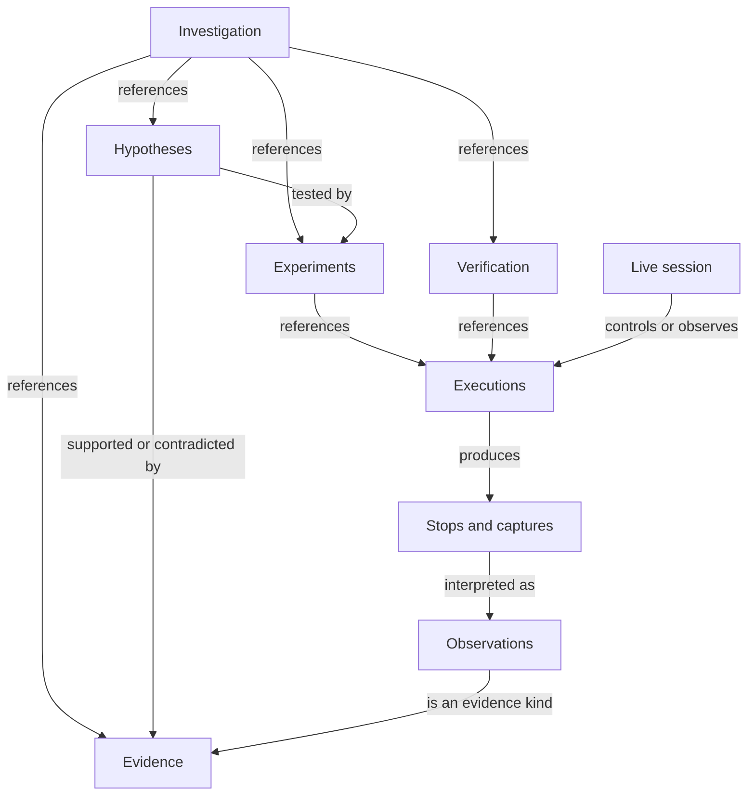
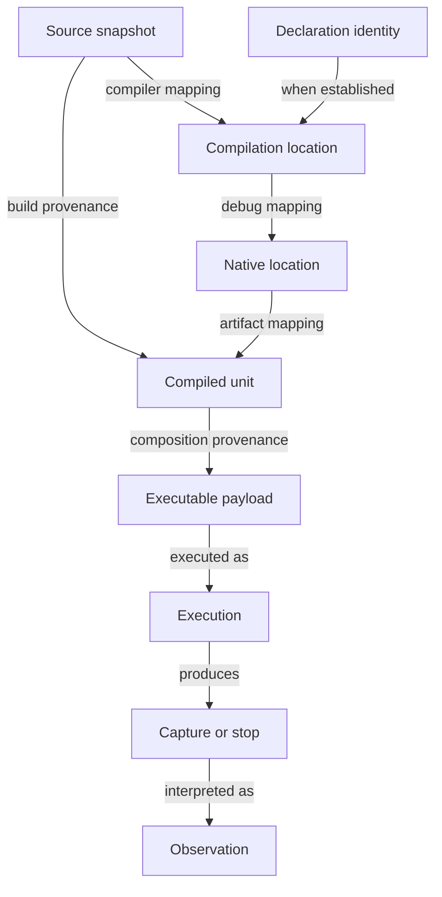

# RFC 126: Oven debugging and evidence-backed investigations

- **Status:** Draft
- **Created:** 2026-09-17
- **Author(s):** Danny Meijer (@dannymeijer)
- **Related:**
    - RFC 018 and RFC 019 (assertions and test runner)
    - RFC 048, RFC 085, RFC 086, RFC 087, and RFC 113 (checked metadata, schemas, and declaration registries)
    - RFC 076 and RFC 078 (mutation policy and typed workflow actions)
    - RFC 080 (AI assets and execution observations)
    - RFC 093, RFC 094, and RFC 095 (telemetry, context managers, and spans)
    - RFC 103 and RFC 104 (secrets, authority, receipts, and replay classifications)
    - RFC 102, RFC 105, and RFC 106 (semantic inspection, advice, and compiler-backed context)
    - RFC 111 (proof-aware contract feedback)
    - RFC 116, RFC 117, RFC 118, and RFC 119 (foreign boundaries and Oven operational authority)
    - RFC 120, RFC 121, RFC 123, and RFC 124 (source, type, executable, and compiled-unit identity)
- **Issue:** [#1638](https://github.com/encero-systems/incan/issues/1638)
- **RFC PR:** —
- **Written against:** v0.6.0-dev.4
- **Shipped in:** —

## Summary

This RFC proposes an Oven-owned architecture through which humans and agents conduct durable, evidence-backed investigations of Rust, Incan, and mixed program executions. Its north star is that humans and agents can investigate unexpected behavior, test competing explanations, and verify repairs across Oven-managed Rust and Incan projects, with inspectable evidence throughout. Compiler services supply checked meaning, runtime integrations supply supported observations, and Oven coordinates the exact artifacts and bounded execution used to test a hypothesis. Native debugging supplies interactive execution control and observation within that architecture; editor and MCP clients consume the same service contracts.

> **Reading this RFC:** Start with the [three test drives](#guide-level-explanation) for the proposed human and agent experience. The core model below introduces the concepts; the [reference-level explanation](#reference-level-explanation) defines their guarantees and limits. The test drives are illustrative, not runnable commands for a shipped feature.

## Core model

1. **An investigation is durable.** A failure, question, counterexample, capture, or exploratory purpose can open a durable record that accumulates references to relevant evidence, hypotheses, experiments, executions, and verification outcomes as the investigation develops.
2. **Meaning and execution have different owners.** Compiler services own language semantics; Oven owns project selection, artifact lifecycle, execution coordination, and investigation sessions.
3. **Rust and Incan are first-class.** Pure Rust, pure Incan, and mixed execution are required acceptance cases. Capabilities can differ, but those differences must be explicit.
4. **Explanations are tested.** A hypothesis records known supporting and contradicting evidence, competing explanations, and observations that could distinguish them; missing evidence remains explicit. An experiment records what was controlled and what remained uncontrolled.
5. **Evidence retains its kind.** Checked facts, advisory findings, proof results, observed values, and agent inferences remain distinct even when presented together.
6. **Clients share state.** CLI, editor, and MCP consumers use one investigation and session contract, with explicit execution-control ownership, immutable captures, and versioned interpretations.
7. **Recording is bounded.** Time, retained bytes, events, inspected values, and external-operation budgets are inspectable. Missing or truncated evidence is never silently treated as absence.
8. **Investigation ends with reviewable evidence.** A claimed resolution or conclusion links back to the original question or reproduction and its verification, without implying general correctness from one passing run.

### Entities and relationships

An investigation is the durable context that accumulates references to hypotheses, experiments, evidence, and verification around a failure, question, counterexample, capture, or exploratory purpose. It is not a live debugger session. These relationships describe a shared semantic model, not a required order of work or a storage ownership tree. An investigation may begin with a crash capture, an exploratory run, or a question; none requires a hypothesis in advance.



An investigation may reference zero or more records of each kind while it develops. An experiment describes an intended test or exploratory purpose and may reference multiple executions, or none if it has not run. An execution is one actual program run, which may produce multiple stops and captures. A rerun creates a new execution identity. A live session is a mutable control/observation relationship around an execution; it owns session revisions, the control lease, and ephemeral handles, not the lifetime of the investigation. A multi-process experiment must identify its constituent executions rather than collapse them into one ambiguous run.

A capture retains selected execution material; an observation interprets captured material or an identified live stop. Evidence includes observations and references to independently owned compiler facts, advice, proof outcomes, receipts, and investigator inferences. An observation is an evidence kind. Referencing an observation as evidence preserves its observation identity and provenance; it does not create a second observation. Verification evaluates a claimed resolution or conclusion against the original failure, question, or reproduction and references the relevant artifacts, configuration, executions, and regression evidence. Evidence and executions may be referenced from more than one investigation, experiment, or verification record. Such references do not transfer authority or imply duplicated execution. Historical inspection requires no live session.

## Motivation

A native debugger can stop a process without giving a developer a reliable path from an unexpected result to a reviewable, evidence-backed investigation. Source and executable mismatches, unreadable values, missing async relationships, transient failure state, and repeated manual reproduction all break that path. Agents face the same problems and additionally pay for unstructured output and a tool round trip for every small inspection operation.

The surrounding RFCs already establish much of the required vocabulary. RFC 106 supplies compiler-backed context; RFC 105 supplies deterministic advisory findings; RFC 111 supplies obligations, assumptions, and counterexamples; RFC 104 supplies execution-bound receipts and honest replay classifications. What is missing is the workflow that connects those facts to an actual native execution, permits bounded experiments, and preserves the result for independent inspection.

Generated Rust is not the source authority, public debugging contract, or required semantic handoff. A backend may expose implementation artifacts for advanced inspection, but ordinary debugging must refer to authored source and checked identities.

## Goals

- Make file, executable, and failing-test debugging accessible without reconstructing Oven's build context manually.
- Provide source-faithful breakpoints, stepping, stacks, and value inspection for the declared supported target and debugger matrix.
- Let humans and agents formulate, run, compare, cancel, and inspect bounded experiments.
- Connect native observations to compiler-backed declarations, test cases, contracts, and operation receipts through verified identity mappings.
- Preserve investigations across process exit and client handover when the required evidence was captured.
- Provide structured, budgeted agent operations as well as ordinary interactive debugger controls.
- Define acceptance evidence for pure Rust, pure Incan, mixed calls in both directions, and supported runtime integrations.

## Non-Goals

- Replacing existing native debugger engines, editor interfaces, compiler services, or the test runner.
- Universal deterministic replay, arbitrary reverse execution, or recovery of information that was never captured.
- Making an effect receipt a full execution trace, a telemetry span a proof, or a passing reproduction proof of general correctness.
- Implementing RFC 111's verifier, RFC 105's rules, or RFC 106's graph extraction inside Oven.
- Making basic debugging depend on the complete RFC 121 type substrate or every optional integration.
- Making arbitrary foreign runtimes, GPUs, or freestanding targets support hosted debugging facilities by implication.
- Defining an autonomous agent that chooses repairs, modifies contracts, or deploys changes without the invoking workflow's authority.
- Mandating a particular debugger vendor or MCP protocol revision.

## Guide-level explanation

These walkthroughs illustrate the proposed experience, not functionality available today. Actions are described in ordinary language; the displayed records are illustrative views, not command syntax, MCP tool names, or wire schemas. The examples assume the capabilities they use are supported. Exact client surfaces remain a design question.

### Test drive: why is the total wrong?

You have an Incan checkout application calling a Rust pricing library. A test says a subtotal of 12,000 cents with a 2,000-cent discount should produce 10,000 cents. It actually produces 8,000 cents.

**1. Open the failed test as an investigation.** Select the failure in your editor. Oven identifies the test execution, the executable it used, and the matching source snapshot. You see the authored Incan caller and Rust callee, without having to reconstruct the build command.

```text
Question: Why did checkout return 8,000 cents instead of 10,000?
Evidence: failed test checkout_discount
Execution: run-A, built from source snapshot A
Source match: verified
```

If your editor contains newer changes, it shows the mismatch and offers the matching source or a new build. It does not place a trustworthy-looking breakpoint against the wrong executable.

**2. Record two explanations.** You or an agent can add these to the investigation. Neither is a diagnosis yet.

| Hypothesis                                         | What would distinguish it?                                            |
| -------------------------------------------------- | --------------------------------------------------------------------- |
| The caller already subtracted the discount.        | Inspect the subtotal supplied at the Rust call boundary.              |
| The pricing function subtracts the discount twice. | Inspect the incoming values and the intermediate subtraction results. |

**3. Run a bounded experiment.** Ask to stop at the pricing call and capture its arguments, with a two-second execution budget. The editor can expose this as an action; an agent requests the same operation through MCP. Both receive evidence tied to the same execution and stop.

```text
Experiment: inspect the pricing call arguments
Execution: run-B, same executable and fixture as run-A
Stopped because: breakpoint reached
Observed: subtotal = 12,000; discount = 2,000
Capture: pricing-entry-B; requested arguments retained
Hypothesis update: caller-subtraction explanation contradicted for this run
Still open: what happens inside the pricing function?
```

The first experiment has narrowed the question. It has not proved the second explanation. Stepping through the function and retaining the selected values then shows 12,000 becoming 10,000 and subsequently 8,000 at two subtraction locations. The investigation links those observations to the second hypothesis. Selecting each frame uses that frame’s language semantics.

**4. Verify the correction.** Remove the extra subtraction and build a new executable. Rerun the original test, then independent cases for zero discount and a different discount amount.

```text
Claim: the duplicate subtraction caused this failing case
Before: run-A / source A → expected 10,000; observed 8,000
After:  run-D / source B → expected 10,000; observed 10,000
Regression cases: zero discount passed; different discount passed
Evidence: original failure, boundary capture, subtraction observations,
          changed artifact, and test results
Limit: these cases do not establish correctness for every pricing rule
```

You can inspect the observations behind the claim rather than trust an agent’s summary. If reduction is supported, you can also ask it to find a smaller failing fixture; ordinary debugging does not depend on having a reducer.

### Test drive: pick up an investigation tomorrow

An agent investigated the pricing failure overnight. Its process has exited and your working tree has changed. You open its retained investigation in the editor.

**What you can do:** inspect the hypotheses, source snapshot, captured arguments, and verification runs; follow each claim to its evidence; compare the before/after artifacts through supported identity mappings. Opening the investigation does not launch the application.

**What you cannot assume:** that every value was saved, that current source matches the old executable, or that the original process can be resumed.

```text
Investigation: checkout_discount
Execution run-B: exited
Captured: subtotal, discount, selected frames
Requested now: customer.account_details
Result: not captured
Action required to obtain it: authorize a new execution and capture
```

“Not captured” does not mean the customer had no account details. Likewise, “optimized out” would mean the value was unavailable in that executable, and “redacted” would mean the display withheld it. Those outcomes call for different next steps.

Suppose a decoder correction later changes how one captured value is interpreted. The original observation remains available, the new interpretation identifies its decoder and references the old observation, and conclusions using the old interpretation expose that relationship. The investigation’s history does not silently change.

If a process is still live, acquiring its control lease lets you coordinate authorized stepping with other clients. It does not grant permission to evaluate effectful expressions, repeat external operations, or edit source.

### Test drive: did the timed-out operation happen?

A supported runtime integration records a worker waiting during an external operation. You ask an agent to run a bounded experiment: wait for the completion condition, capture the relevant task/wait evidence, and stop after two seconds.

The request times out before completion is observed. A useful result keeps several facts separate:

| Question                                     | What the evidence says                                                                           |
| -------------------------------------------- | ------------------------------------------------------------------------------------------------ |
| Why did the bounded experiment stop waiting? | Its time budget expired.                                                                         |
| Was completion observed?                     | No, within the captured interval.                                                                |
| Did the external operation execute?          | It may have; confirmation is unavailable.                                                        |
| Was cancellation successful?                 | Cancellation was requested; stopping is not confirmed.                                           |
| What runtime evidence exists?                | The captured worker wait and its declared coverage; uninstrumented relationships remain unknown. |

The agent cannot safely conclude “the operation failed, so retry it.” It follows the retained operation identity to reconcile the outcome, using the supported operation/receipt contract. Repeating an external effect requires its own authority; a debugger control lease is insufficient.

A later result may establish that the operation completed despite the timeout. Or the outcome may remain uncertain. Both are more useful than a false failure claim that causes a duplicate operation.

### Reading the contracts behind the examples

The first walkthrough uses investigation records, mixed-language debugging, bounded experiments, and verification. The second adds historical inspection. The third depends on supported runtime observation and operation reconciliation. None assumes universal replay or a complete trace of every event.

The reference sections below explain what must stay true across those experiences: who owns the facts, how identities connect, what a capability promises, what authority an action requires, and what the evidence can establish.

## Reference-level explanation

### Ownership and supported capabilities

Oven must own workspace and target selection, artifact acquisition and retention, execution coordination, and investigation lifecycle. Language services must own source meaning, expression semantics, and the mapping of language-level values and locations to the selected executable. Runtime providers must identify the observations they support. Clients must not independently reconstruct those facts from generated-source spellings or terminal output.

Each session must expose a versioned capability description identifying target, architecture, toolchain, debugger engine, language integrations, runtime integrations, optimization/debug profile, and supported operations. Unsupported combinations must be rejected or explicitly degraded before an operation claims success. Pure Rust use must not require authored Incan application code or Incan-specific proof metadata.

### Investigation and evidence records

An investigation must have an identity and schema version. It must record its initiating failure, question, counterexample, capture, or exploratory purpose and accumulate references to available evidence as the investigation develops. Source snapshots, execution configurations, executable payload identities, and debug/source artifacts belong to the relevant execution/evidence records; an investigation may span multiple builds and may exist before any executable is selected. Unknown associations must remain explicit. It may link RFC 106 context, RFC 105 findings, RFC 111 obligations and assumptions, RFC 104 receipts, and RFC 093 telemetry without changing their owning semantics.

An experiment must reference its hypotheses, if any, and record its purpose, reproduction recipe, controlled inputs, uncontrolled dependencies, stop/capture conditions, budgets, execution mode, and outcome. A recipe must identify the test or action, arguments, fixture references, working-directory mapping, relevant environment inputs, and seed when applicable. Secrets must be represented through authorized references or redaction markers rather than copied into recipes by default.

Evidence records must distinguish compiler-established facts, deterministic advisory findings, proof outcomes with assumptions, runtime observations, and investigator inferences. Each observation must name its producing execution and capture or stop. An assessment of a hypothesis must not overwrite the certainty or provenance of its underlying evidence. Observation of one path must not imply completeness over all paths.

### Hypotheses and interpretation history

A hypothesis must have an identity, a statement, and versioned references to supporting evidence, contradicting evidence, competing hypotheses, and discriminating experiments or observations where known. An exploratory experiment need not invent a hypothesis. One observation may support several explanations and must not silently establish any of them as the cause.

Hypothesis assessments must record their author or producing service, rationale, evidence references, and revision. An open assessment means evaluation remains pending; supported means cited evidence favors the statement under recorded assumptions; weakened means cited evidence reduces that support; contradicted means cited evidence conflicts with the statement under recorded assumptions; unresolved means the available evidence does not distinguish the relevant alternatives. These are investigation assessments, not truth certificates or a mandatory linear progression. The default contract must not assign numeric confidence. An extension using probabilities must identify its probabilistic model and assumptions rather than present an arbitrary score as calibrated certainty.

Captured bytes, events, and retained state must be immutable. Each decoded observation must identify its capture or live stop, decoder/schema version, relevant type/debug metadata, and decoding limits. Live observations intended for later inspection must retain their decoded result and disclose whether the underlying material was captured. A later correction or reinterpretation must create a new observation referencing the previous one and its reason; it must not overwrite the original. Inferences remain separate from observations. A corrected interpretation must not silently rewrite hypotheses or verification conclusions that cited the earlier interpretation; consumers must expose the correction relationship when presenting those references.

### Capability profiles and conformance

The architecture defines investigations, hypotheses, experiments, executions, evidence, and verification even when a provider implements only some operations. Every participating provider must preserve identities, evidence kinds, availability, budgets, and authority boundaries. Service-level capability discovery must also work without a live session, including for historical-only consumers. Capability conformance must identify the profile and version, supported language/target/runtime combinations, limits, and executable acceptance evidence. A partial profile must list the unmet obligations; it must not claim full conformance. Supporting one profile does not imply that the entire architecture is implemented.

Profile conformance means that a provider/configuration satisfies the obligations of a declared profile. Integrated Oven-system conformance means that the composed system demonstrates the end-to-end investigation semantics in the acceptance criteria, including durable evidence, experiments, execution relationships, client interoperability, and verification. Individual profile conformance or schema compatibility alone does not establish integrated conformance.

A provider whose profile requires investigation records must participate in Oven’s investigation-record contract and produce or consume the required records; it need not implement or own the investigation persistence service.

The following profiles describe semantic obligations, not fixed protocol identifiers or an implementation sequence:

| Profile                  | Required guarantees                                                                                                                                                                                                                                                              |
| ------------------------ | -------------------------------------------------------------------------------------------------------------------------------------------------------------------------------------------------------------------------------------------------------------------------------- |
| Investigation records    | Durable identities and relationships for the shared model; reopening persisted records and decoded evidence; provenance, versioned interpretations, availability, and bounded retrieval.                                                                                         |
| Native debugging         | Exact executable/source binding; supported launch or attach; stop/resume; useful authored-source breakpoint and stepping mappings; frames and bounded values; shared control, stale-handle refusal, and retained observations tied to execution. Requires investigation records. |
| Mixed-language debugging | Native debugging across Rust/Incan calls in both directions, with frame-language semantics and explicit boundary mappings. Requires native debugging.                                                                                                                            |
| Bounded experiments      | Purpose or hypothesis links, reproducible recipes, controlled/uncontrolled inputs, budgets, cancellation and reconciliation, comparison evidence, and verification links. Requires investigation records and an execution provider.                                              |
| Counterexample reduction | Bounded experiments with an explicit failure predicate, recorded transformations, validation outcomes, and honest nondeterminism/minimality limits. Requires bounded experiments.                                                                                                |
| Runtime observation      | Identified runtime tasks/events/waits and declared coverage, causal limits, sampling, loss, and capture overhead. Requires investigation records.                                                                                                                                |
| Expression evaluation    | Frame-language semantics, separately authorized target execution, declared expression support and effects, and evidence of outcomes. Requires an execution provider and investigation records.                                                                                   |
| Historical inspection    | Inspect and decode retained capture material without live execution, with artifact availability, decoder identity, integrity, and completeness checks. Requires investigation records.                                                                                           |
| Execution replay         | A supported execution-recording mechanism, explicit nondeterminism and boundary coverage, replay identities, and authority checks. Requires historical inspection and an execution provider.                                                                                     |
| Evidence correlation     | Provenance-bearing links to the advertised telemetry, receipt, proof, or advisory services without changing their semantics or implying complete coverage. Requires investigation records.                                                                                       |

An execution provider is an operational role that launches or attaches to executions, supplies their identities and artifact/configuration associations, and reports supported control operations and their outcomes under Oven authority. It must obey the shared identity, authority, budget, cancellation, and reconciliation contracts for the operations it exposes. It is not an additional capability profile. An execution provider may use the test runner or typed actions without exposing interactive debugging. A declared native debugging profile must nevertheless demonstrate meaningful source stops, stepping, frames, and selected values on representative programs for each claimed configuration. Reporting all mappings or values as unavailable is not sufficient. A profile must specify its required cases and admissible limitations; capability discovery cannot weaken those obligations on a per-request basis.

The shared investigation model must support recording hypotheses, experiments, and verification even when automation for a particular activity is unavailable. A consumer must distinguish the ability to record or inspect a result from the ability to execute, reduce, evaluate, or replay it.

### Source, artifact, and value identity

Sessions must bind executable payloads and debug artifacts to their producer and source snapshot. Symbol names alone are insufficient to establish that a source buffer matches the executing artifact. Uncommitted source used for a build must have a capture or digest that distinguishes it from the repository revision alone.

RFC 120 and RFC 106 supply source identity semantics; RFC 124 supplies compiled-unit and payload identity semantics. Cross-build comparisons must use accepted identity mappings and retain both build identities. Where durable declaration identity or a mapping is unavailable, the comparison must report that limit rather than match by name or line number and call it exact.

Identity relationships form a graph rather than a mandatory chain:



The arrows denote asserted relationships, not mandatory paths or universal one-to-one correspondences. Each asserted edge must identify its producer, evidence, mapping semantics, and applicable artifact/source revisions under the owning identity contract. Exact identity and correspondence across edits must remain distinct; missing, ambiguous, or invalidated mappings must not be bridged heuristically and called exact. Exact source-snapshot/executable correspondence can support debugging without durable declaration correspondence across edits. Cross-build claims require the additional mappings appropriate to those claims.

Debug artifacts and retained captures must have explicit leases, pins, or another accepted retention relationship to the Oven store. Export must enumerate missing dependencies and capture limits. Reopening must verify retained payload identities; an investigation file must not silently resolve to a newer executable.

### Native debugging fidelity

For supported development profiles, source-level breakpoints and stepping must resolve through compiler-established mappings to authored executable locations. An authored executable location is a source span associated with executable behavior by the language service, not a promise of one machine instruction or one stop per source expression. The service must expose ambiguity, relocation, coalescing, and unavailable mappings rather than synthesize execution structure unsupported by the executable. Unbound breakpoints must report that status. These limits do not waive the native profile’s required source-level acceptance cases. Native frames, reconstructed inline frames, and runtime-derived logical async frames must remain distinguishable.

Values must report their source type and availability. Availability must distinguish available, optimized out, inaccessible, unsupported decoding, redacted, omitted for budget, not captured, not applicable, and unavailable because capture material is lost or corrupt. Unknown causes must remain unknown. These states must not be rendered as ordinary null or empty values. Availability of a requested value is separate from capture completeness and integrity: a valid partial capture may omit the value, while a corrupt capture cannot establish the value’s absence. A value’s unavailability may cite a capture-integrity failure as its cause; that does not replace the separate capture completeness and integrity report. Providers must preserve these shared meanings even if they add more specific reasons. Value expansion must be bounded and paginated where necessary, handle cycles, and avoid silently invoking arbitrary application formatting code. Target memory reads that may have effects, including device memory, must not be treated as passive inspection by default.

The development profile should prioritize predictable stepping and inspectable locals. Optimized profiles must state their weaker guarantees. Transformations such as inlining, tail-recursion lowering, and ownership planning should be explainable through compiler facts; tools must not fabricate physical frames or recoverability to resemble the original source.

### Session lifecycle and shared control

A live session must distinguish launching, running, stopped, exited, detached, cancelled, and failed states, or an equivalent explicit state model. State-changing requests must include an expected session revision or equivalent concurrency guard. At most one client may own execution control at a time; other authorized clients may inspect retained state. Handover must be explicit, and conflicting requests must fail without silently changing the process. Execution-control ownership serializes authorized process-control operations; the lease itself grants no inspection, evaluation, rerun, input-change, external-operation, source-edit, or contract-edit authority. Each operation must independently satisfy its applicable authority requirements.

Live value handles must be scoped to a stop generation and become invalid after resume, restart, or termination. Retained captures and their decoded observations have separate identities and the interpretation-history guarantees above. Long-running operations must expose operation identity, progress, cancellation, and a bounded wait surface. Retrying a request must not duplicate a launch or external effect; the service must provide deduplication or report an uncertain outcome requiring reconciliation.

Launch, attach, detach, terminate, and client-disconnect behavior must be explicit. A disconnect must not silently kill an attached process. Capture failure must not be reported as successful capture, and process cleanup must report failures rather than claim containment that the host cannot provide.

### Operation outcomes and reconciliation

An operation result must preserve separate facts about request progress, execution occurrence, cancellation, and observed experimental conditions. Request progress must distinguish submission, acceptance or rejection, active work, terminal state, and unknown state where applicable; these are separate from knowledge about effects. Request acceptance or transport acknowledgement must not imply that execution occurred or that its intended effect completed. Execution occurrence must distinguish definitely not executed, may have executed, and definitely executed, with evidence for the asserted knowledge. Multi-step operations must report these facts for the relevant constituent actions rather than hide partial execution behind one success/failure value.

Cancellation must distinguish not requested, requested, acknowledged, confirmed stopped, and unknown where applicable. A cancellation acknowledgement is not proof of process termination or effect rollback. The experimental observation outcome must separately identify whether the requested condition was observed, was not observed within the covered interval, or could not be assessed because observation was unavailable. The execution stop reason, defined below, describes why execution or the bounded operation stopped; it is a separate fact. A timeout can coexist with an unobserved condition, and process exit can coexist with unavailable observation. Neither dimension determines the other, and capture limits must remain explicit.

A timeout may leave execution occurrence and cancellation uncertain while the requested condition remains unobserved. The service must retain an operation identity and a reconciliation mechanism for such outcomes. A retry must reuse deduplication identity or reconcile the prior operation before repeating an effect; a client must not infer that retrying is safe merely because its previous request timed out. RFC 104 authority and receipt semantics continue to apply to constituent external operations.

### Experiments, evaluation, and replay

The service must separate passive inspection, expression evaluation that executes target code, resume, restart, rerun with changed inputs, and replay. Passive inspection must not intentionally execute target code or invoke an effectful target/provider operation. Decoding retained bytes may be passive wherever the decoder runs; a formatter, synthetic child, property accessor, or runtime helper that executes target code is evaluation regardless of which provider invokes it. Unknown effects must not be classified as passive. Host-side decoding remains subject to resource budgets and capture-access authority. Execution authority must be checked independently from the ability to read a capture. An expression evaluator must use the selected frame's language, disclose supported constructs, and reject unsupported evaluation rather than reinterpret an expression in another language.

A bounded experiment should combine resume, stop-condition evaluation, and selected capture into one client operation. It must identify why it stopped, including condition met, process exit, timeout, cancellation, budget exhaustion, or provider failure. A failure to reach a condition within a budget is inconclusive, not evidence that the condition is impossible.

Historical inspection reads recorded evidence. Replay here refers to program execution, not replaying debugger protocol requests. Replay reproduces execution using a declared supported recording mechanism. A rerun performs another execution and may repeat side effects. Replaying against changed code is a new experiment, not the original recorded execution. Operation replayability must reuse RFC 104 classifications; execution replay support must additionally identify unrecorded nondeterminism and foreign/runtime boundaries. Receipts alone must not establish replay support.

When counterexample reduction is supported, it must preserve an explicit failure predicate and record the attempted transformations and validation outcomes. The result may be a smaller reproducer; it must not claim global minimality without evidence. A reduction with uncontrolled nondeterminism must expose that limitation. Verification must state the claimed resolution or conclusion, the conditions under which it was evaluated, and the evidence and limits of that evaluation. A resolution may involve source, configuration, dependency, fixture, or environment changes. An inability to reproduce an observed failure is itself an outcome with stated conditions and limits; it does not establish that the failure is absent or resolved. For an implementation repair, verification must identify the changed artifact, rerun the original reproduction against it, and retain independent regression results. Verification must not silently weaken the asserted contract to declare success.

### Capture, telemetry, and domain integration

Capture policies must bound time, event count, retained bytes, value depth, and applicable operation budgets. Providers must report sampling, truncation, dropped events, clock domains, and instrumentation settings. A local sequence or timestamp must not imply a total causal order across independent processes.

Runtime providers may expose tasks, waits, cancellation, and bounded historical events. Domain libraries may expose typed operations and inspectors through checked metadata and declaration registries. Domain semantics remain library-owned. Unknown relationships must remain visible as unknown; absence from a partial trace is not proof that an operation never occurred.

RFC 104 reporting modes and receipt-free permissive mode must remain intact. A debugger capture must not manufacture authority receipts for a receipt-free run or imply that raw foreign calls were governed. Telemetry export remains opt-in under RFC 093. Local capture and remote export are distinct choices.

### Secrets and mutation boundaries

Incan-owned typed displays, MCP outputs, and structured bundles must preserve RFC 103 redaction. Raw memory captures and foreign values may contain secrets beyond those guarantees; such captures must expose sensitivity and export restrictions. Redaction may prevent replay and must be recorded as such. Expression evaluation, reruns, tool invocation, and source edits must retain their own authority boundaries under RFC 104, RFC 078, and RFC 076 as applicable.

An investigation service must not turn the read-only RFC 106 context surface into implicit execution authority. Contract modifications must remain distinguishable from implementation repairs under RFC 111. Recorded target output and source text are evidence data, not instructions to the agent client.

### Human and agent interfaces

Editor, CLI, and MCP adapters must consume the same investigation/session contracts and return consistent identities and outcomes. MCP operations should expose task-sized investigations and bounded context packs, with low-level debugger controls available for narrower inspection. Tool names and wire mappings must preserve the shared contract across clients.

A response must expose its budget, omissions, freshness, and continuation mechanism where applicable. A human-readable explanation must retain links to structured evidence. MCP transport sessions must not define the lifetime of an investigation or live debuggee. The user-program MCP authoring proposal ([#1624](https://github.com/encero-systems/incan/issues/1624)) and the compiler-context MCP service remain distinct integrations.

### Acceptance criteria

The supported target/debugger/runtime matrix, measurable latency and overhead budgets, and explicit exclusions must be documented. Conformance must be demonstrated with executable evidence.

Integrated Oven-system conformance must exercise the shared investigation model across pure Rust, pure Incan, and mixed execution in both call directions. The end-to-end corpus must include an incorrect result investigated through competing hypotheses and bounded experiments, repair verification against the original reproduction, and retained evidence reopened by another client. Each provider must pass the cases for its claimed profiles and configurations; native debugging profile conformance alone is not a claim of integrated Oven-system conformance. Reduction cases must demonstrate preserved failure predicates when reduction is claimed. Runtime observation cases must demonstrate hung or cancelled work and the supported task/wait evidence. Historical inspection and execution replay require distinct cases proving their respective guarantees.

Negative cases must include stale source, missing symbols, optimized-out state, stale handles, concurrent control requests, cancellation, duplicate requests, redaction, unsupported runtimes, unavailable replay, and truncated captures. Editor and MCP consumers must demonstrate consistent evidence. Debugging tests must drive real native artifacts and debugger sessions; metadata snapshots alone are insufficient. Record and client conformance must also exercise investigations that begin without hypotheses, evidence shared across investigations, corrected decoding, absent cross-edit identity mappings, and uncertain execution/cancellation outcomes. Unsupported capabilities must remain discoverable and must not prevent inspection of already retained evidence.

Measure diagnosis and repair correctness, unsupported causal claims, setup steps, tool calls, token/output volume, elapsed investigation time, capture overhead, and retained size against a shell/log baseline on fixed seeded tasks. Acceptance thresholds and repeated-run methodology must be explicit. Deterministic replay, foreign-runtime coverage, and freestanding debugging must each declare their supported capabilities and limits.

## Design details

### Existing contracts and prerequisites

RFC 102 joins inspectable project facts; RFC 106 supplies semantic context; RFC 105 supplies advice; RFC 111 supplies proof-aware obligations. This RFC links them to experiments without merging their authorities. Basic debugging must work when optional advice, telemetry, or proof providers are absent.

RFC 118 fixes the command/service boundary. Oven consumes language services and never routes through the Incan CLI. RFC 117 and RFC 119 retain project, target, and provider authority. RFC 121 contributes supported representation facts without becoming an all-or-nothing prerequisite. RFC 123 may support semantic experiments, but an interpreted result must not be presented as native execution evidence.

RFC 019 owns test discovery, fixtures, selection, seeds, and reporting. Investigation recipes must reference that contract instead of defining another runner. RFC 080 contributes AI asset and execution-profile identity; repeating a model request must not be called exact replay without a supported recording mechanism. RFC 094 and RFC 095 supply scope-lifetime and span semantics; those facts do not by themselves supply scheduler history.

Language features such as async closures, stack-safe lowering, algebraic numeric operations, unsafe/layout controls, and interop require debugging acceptance cases for their supported semantics. Capabilities must be declared independently so that an unsupported feature does not obscure the guarantees of a supported one.

### Identity and evolution

Every public record family must be versioned. Readers must preserve unknown evidence kinds or refuse unsupported required semantics explicitly. Missing source, unavailable mappings, and stale evidence must remain first-class outcomes. A later capture or explanation may reference earlier evidence but must not rewrite the historical observation.

The exact relationship between durable declarations, compilation-specific locations, native symbols, and store payloads must be settled with RFC 106, RFC 120, and RFC 124 before cross-build comparison is claimed. Source-content identity, declaration continuity, and executable identity serve different purposes.

## Alternatives considered

- **Expose native debugger commands directly through MCP.** Useful as an escape hatch, but insufficient for durable evidence, bounded experiments, identity checks, and shared human/agent control.
- **Build an Incan-only debugger.** Rejected because Oven owns Rust and mixed projects as first-class workloads.
- **Make telemetry the debugger.** Telemetry supplies selected events, not complete locals, breakpoint semantics, or native process control.
- **Make receipts the replay engine.** Receipt classification describes what is known about operations; it does not capture every source of nondeterminism.
- **Require universal replay or complete verification for debugging.** This conflates independently valuable capabilities and excludes useful investigations where replay or verification is unavailable.
- **Let each client own a separate session model.** This creates races, stale handles, and inconsistent evidence during human/agent handover.

## Prior art

This proposal combines lessons from interactive debuggers, runtime recordings, repeatable tests, and tools for AI applications. The comparisons below identify specific documented behavior and the design lesson drawn from it. They are not claims that another ecosystem lacks every capability described here, nor commitments to adopt a particular implementation.

### Rust: make ordinary debugging worth the effort

The [Rust debugging survey results](https://blog.rust-lang.org/2026/09/07/rust-debugging-survey-2026-results/) report setup friction, poor value representations, and stepping problems, including async code. They also document mixed-language debugging and the use of debugger visualizers. These are reports from survey respondents, not a universal assessment of every Rust debugger.

**Lesson for this RFC:** readable values, trustworthy source mappings, and an easy path from a failing test to its executable are core acceptance concerns. A durable investigation model does not compensate for a debugger that cannot show a collection’s contents. Rust and mixed projects therefore belong in the acceptance corpus alongside Incan.

### Python: enter the failure and inspect it directly

Python’s [`pdb`](https://docs.python.org/3/library/pdb.html) supports source stepping, frame inspection, interactive evaluation, and post-mortem debugging. Its `breakpoint()` entry point illustrates a short path from authored code to inspection.

**Lesson for this RFC:** preserve that immediacy when starting from a failure or source location. For native execution, Oven also binds the source and executable explicitly. Evaluation remains separately authorized because executing an expression is different from reading a retained value; an investigation must also survive the interactive session.

### Java Flight Recorder: keep useful runtime history

[Java Flight Recorder](https://docs.oracle.com/en/java/javase/25/troubleshoot/troubleshoot-performance-issues-using-jfr.html) provides recordings for investigating runtime behavior such as I/O, synchronization, and garbage collection. Its documentation explains that recording settings and event thresholds affect both overhead and what appears in the recording.

**Lesson for this RFC:** runtime evidence should remain inspectable after the event, with its capture policy attached. An absent event in a thresholded or partial recording is not proof that the operation never occurred. This motivates explicit coverage, overhead, and loss reporting, rather than treating a recording as a complete execution history.

### DAP and Mojo: reuse debugger infrastructure and expose capabilities

The [Debug Adapter Protocol](https://microsoft.github.io/debug-adapter-protocol/overview) separates editor interfaces from concrete debugger implementations and exchanges capability information. [Mojo’s debugging tools](https://mojolang.org/docs/tools/debugging/) demonstrate a newer language using LLDB, a language plugin, and VS Code integration rather than inventing an entire debugger stack.

**Lesson for this RFC:** existing debugger engines and editor adapters can supply native control and inspection. Oven retains project, artifact, and investigation authority; a DAP session does not define the lifetime of an investigation. Advertised capabilities need the profile acceptance obligations defined here. This comparison does not select an engine or settle the support matrix.

### rr: distinguish replay from another attempt

[rr](https://rr-project.org/) records executions and supports deterministic replay and reverse debugging within its supported environment. Its documentation also makes platform and execution constraints explicit.

**Lesson for this RFC:** revisiting the same recorded execution is materially different from rerunning the same inputs. Preserve that distinction in the evidence model. Historical inspection remains useful without replay, and an execution-replay claim must identify the recording mechanism and its boundaries. Receipts or saved logs alone do not establish that guarantee.

### Hypothesis: make the failing case easier to understand

The Python testing library Hypothesis [shrinks generated failing examples](https://hypothesis.readthedocs.io/en/latest/glossary.html) and [checks failure reproduction](https://hypothesis.readthedocs.io/en/latest/explanation/test-case-count.html). Its [flaky-failure guidance](https://hypothesis.readthedocs.io/en/latest/tutorial/flaky.html) explains why dependence on uncontrolled state can undermine reproduction and shrinking. The library’s name is distinct from this RFC’s hypothesis records.

**Lesson for this RFC:** reduction is an experiment with a failure predicate, controlled inputs, and recorded outcomes. A smaller fixture is valuable evidence, but does not by itself establish the root cause or global minimality. Reduction is a separately advertised capability that composes with the existing test runner.

### BAML: put inspectable test cases beside AI behavior

BAML provides [named tests with arguments and assertions](https://docs.boundaryml.com/ref/baml/test), with execution through its [editor playground and CLI](https://docs.boundaryml.com/guide/baml-basics/testing-functions). Its [prompt review](https://docs.boundaryml.com/guide/baml-basics/multi-modal) exposes how inputs become model requests. This is a concrete lesson from a language focused on AI application development, rather than a claim about all “AI-first” languages.

**Lesson for this RFC:** make the experiment’s inputs, action, and result inspectable in the normal development flow. For an agent investigator, extend that experience to bounded operations and evidence another client can reopen. Repeating a model request is still a new execution unless a supported replay mechanism establishes otherwise; structured output alone is not causal evidence.

### What this RFC brings together

The proposed contribution is the shared contract connecting these activities: a question leads to experiments over identified executions, observations retain provenance, explanations remain distinguishable from facts, and verification links a claimed resolution to reviewable evidence. Existing tools demonstrate valuable parts of that experience. RFC 126 makes their composition an explicit Oven responsibility across Rust, Incan, and human and agent clients, without claiming that debugging, recording, or experimental testing are new ideas.

## Drawbacks

Native debugger and runtime integrations create a platform/version support matrix that requires ongoing conformance testing. Capturing values and execution events costs CPU, memory, storage, and sometimes changes timing. Sensitive data can enter raw captures even when typed views redact it. Durable investigations also require retention policy and artifact availability. These costs must be measured and exposed rather than hidden behind a seamless interface.

Evidence can be accurate while a diagnosis remains wrong. A reproduction can pass without covering the original environmental cause. The service can preserve evidence and test outcomes, but it cannot guarantee that an investigator selected the right hypothesis, contract, or repair.

## Implementation architecture

Non-normatively, an Oven investigation service connects durable records and bounded experiments to existing execution APIs and evidence storage. Native-debugger providers supply interactive execution control and observations; runtime providers and typed actions contribute their supported evidence. Compiler-owned semantic services establish meaning and identity mappings. These services compose without making the debugger session the owner of the investigation or introducing a second test runner. CLI, editor/DAP, and MCP adapters should remain consumers. Checked declaration metadata can describe domain inspectors without making a generic plugin ABI a prerequisite. Implementation language and crate boundaries remain governed by existing authoring and Oven ownership rules; this RFC grants no new authored-Rust exception.

## Layers affected

- **Compiler semantics and lowering:** preservation and projection of source locations, scopes, types, transformations, and value availability.
- **Native debug metadata and language services:** source stepping, structured inspection, expression semantics, and foreign-boundary fidelity.
- **Oven operational services and store:** session control, selected artifacts, leases, experiment execution, and evidence retention.
- **Stdlib and runtime integrations:** supported task/wait observations, scoped captures, redaction, receipts, and telemetry correlation.
- **Test runner and typed actions:** reproducible invocation metadata, fixtures, failure predicates, and verification linkage.
- **Editor, CLI, and MCP:** shared session views, bounded operations, handover, and evidence navigation.
- **Documentation and conformance:** support matrix, failure modes, investigation examples, and native execution proof.

## Unresolved questions

- **D1 — Profiles and support matrix:** What versioned profile definitions and required source/frame/value cases establish conformance, and which debugger engines, operating systems, architectures, development/optimized profiles, and attach/post-mortem modes satisfy them?
- **D2 — Identity and retention:** What owner-defined edge semantics and evidence establish the identity graph, distinguish exact-build debugging from cross-edit correspondence, and bind exported captures to retained artifacts?
- **D3 — Service schemas and control:** What exact versioned records and reference cardinalities, hypothesis assessments, interpretation revisions, orthogonal operation outcomes, concurrency guards, reconciliation semantics, and CLI/editor/MCP operations express the shared contract?
- **D4 — Evaluation and capture:** Which passive value decoders and expression subset are supported, how are effects and independent authorities checked, and what availability, completeness, integrity, and sensitivity rules govern captures?
- **D5 — Runtime history and replay:** Which runtime integrations support task/wait capture, which historical and replay mechanisms preserve the required evidence, and how are unsupported boundaries reported?
- **D6 — Experiments and reduction:** What recipe, fixture, failure-predicate, comparison, and reduction contracts compose with the test runner and typed actions?
- **D7 — Quantitative acceptance:** Which seeded corpus, baseline, repeated-run methodology, and latency/overhead/storage/diagnosis thresholds define conformance?

<!-- Rename this section to "Design Decisions" once all questions have been resolved.
     An RFC cannot move from Draft to Planned until no unresolved questions remain. -->
