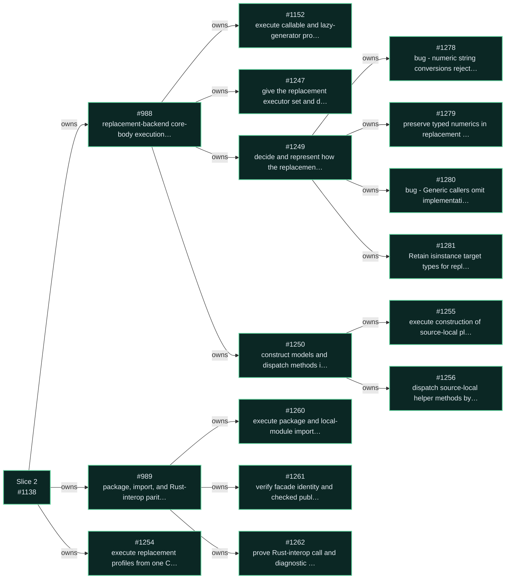
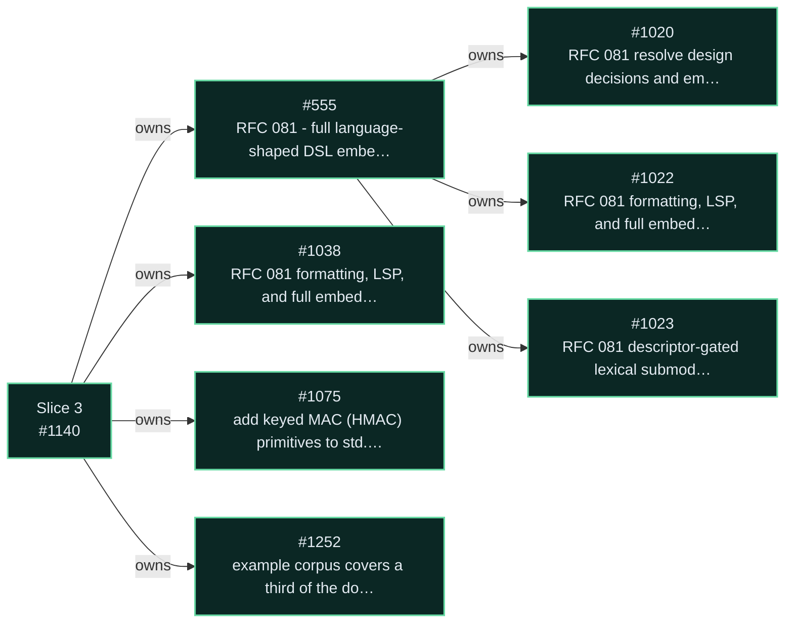
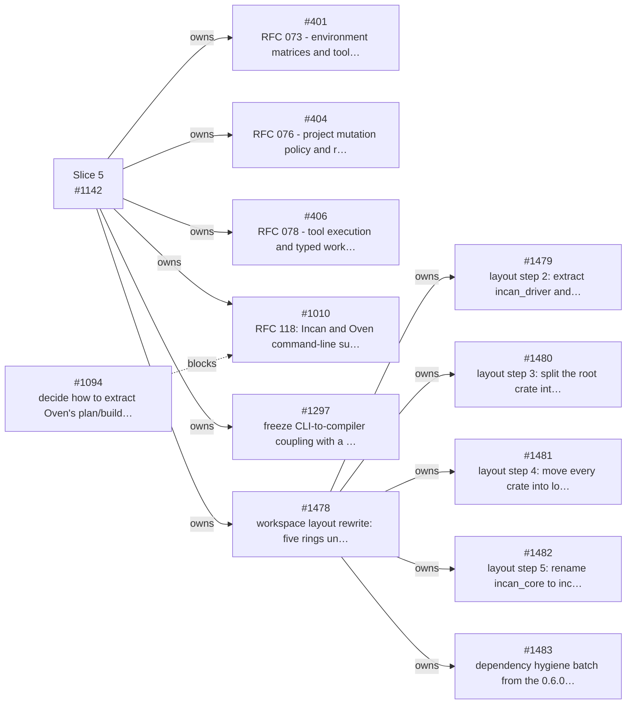
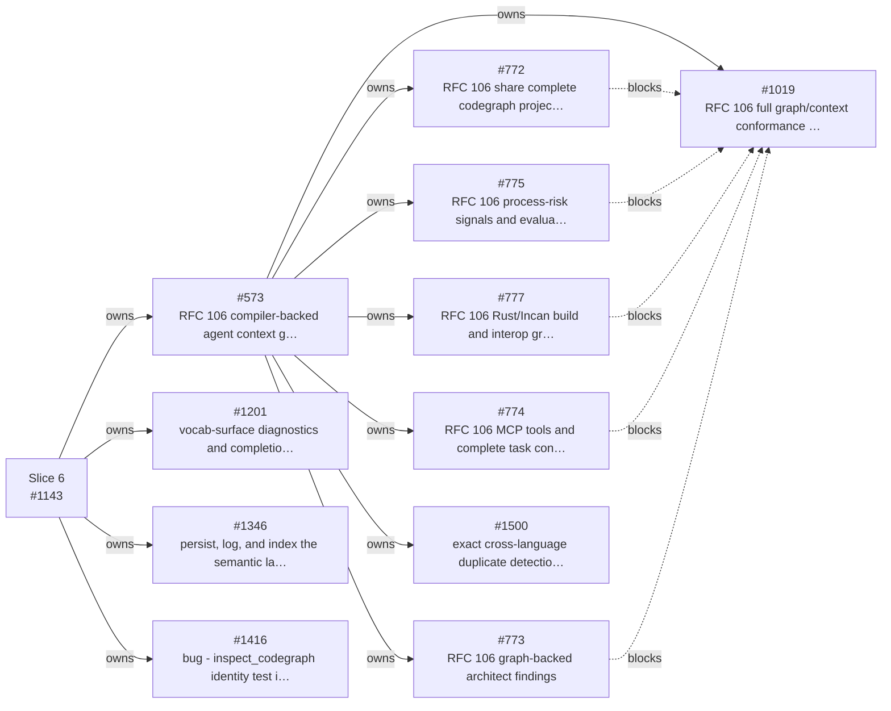
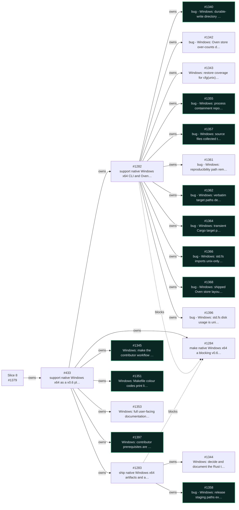
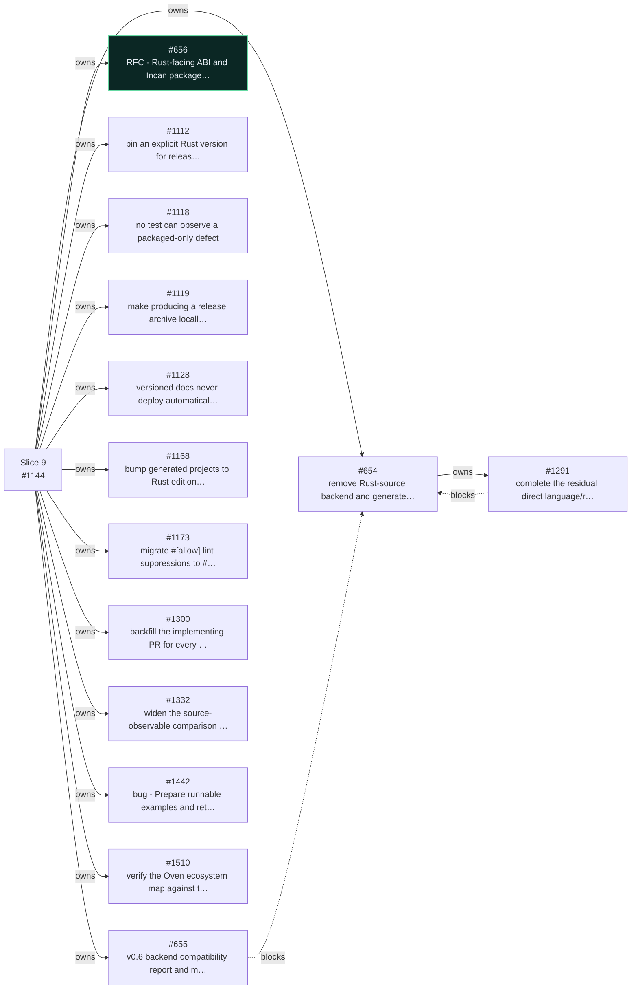

<!-- Generated by `scripts/v0_6_roadmap/render_roadmap.sh`; do not edit by hand. -->

**GitHub snapshot:** 2026-09-13. In this map, **complete** means the GitHub issue is closed; **open** means it remains unfinished. Complete issue nodes are green; open nodes retain the gold outline.

<table class="inc-v06-roadmap-table">
  <thead>
    <tr>
      <th scope="col">Slice</th>
      <th scope="col">Focus</th>
      <th scope="col">Proof before moving on</th>
    </tr>
  </thead>
  <tbody>
    <tr data-v06-slice-target="slice-01-cutover-foundation">
      <td><button type="button" class="inc-v06-slice-toggle">1. Cutover foundation</button>
28 complete0 open
</td>
      <td>Cutover facts, Body IR, and parity.</td>
      <td>Selected and executed routes are receipted; unavailable comparisons stay non-green.</td>
    </tr>
    <tr data-v06-slice-target="slice-02-first-executable-proof">
      <td><button type="button" class="inc-v06-slice-toggle">2. First executable proof</button>
17 complete0 open
</td>
      <td>Direct execution of a bounded Body-IR program.</td>
      <td>Source spans, semantic facts, and paired receipts survive execution.</td>
    </tr>
    <tr data-v06-slice-target="slice-03-language-runtime-matrix">
      <td><button type="button" class="inc-v06-slice-toggle">3. Language and runtime matrix</button>
8 complete0 open
</td>
      <td>Embedded fragments, capabilities, and package vocabulary.</td>
      <td>Accepted constructs have parity, diagnostics, inspection, and migration evidence.</td>
    </tr>
    <tr data-v06-slice-target="slice-04-oven-authority-native-rust">
      <td><button type="button" class="inc-v06-slice-toggle">4. Oven authority and native Rust</button>
4 complete38 open
</td>
      <td>Loaf authority, governed providers, and bounded Rust facets.</td>
      <td>Incan-only, Rust-only, and mixed Loaves bake without Cargo being authoritative.</td>
    </tr>
    <tr data-v06-slice-target="slice-05-oven-cli-delivery">
      <td><button type="button" class="inc-v06-slice-toggle">5. Oven CLI delivery</button>
0 complete12 open
</td>
      <td>Shared Oven planning for build and bake.</td>
      <td>One plan and receipt model; neither CLI gains a competing planner.</td>
    </tr>
    <tr data-v06-slice-target="slice-06-first-class-inspectability">
      <td><button type="button" class="inc-v06-slice-toggle">6. First-class inspectability</button>
0 complete12 open
</td>
      <td>Shared compiler, package, artifact, and Rust/Oven inspection facts.</td>
      <td>CLI, LSP, Architect, MCP, and Rust inspection agree on identity and provenance.</td>
    </tr>
    <tr data-v06-slice-target="slice-07-canonical-source-meaning">
      <td><button type="button" class="inc-v06-slice-toggle">7. Canonical source meaning</button>
8 complete38 open
</td>
      <td>One source identity across compiler, tools, and backend facts.</td>
      <td>Aliases, imports, locals, members, and binders resolve consistently.</td>
    </tr>
    <tr data-v06-slice-target="slice-08-native-windows">
      <td><button type="button" class="inc-v06-slice-toggle">8. Native Windows support</button>
11 complete11 open
</td>
      <td>A Windows host that builds, bakes, and ships like the others.</td>
      <td>A packaged Windows toolchain builds and runs a project, not merely a bake that exits zero.</td>
    </tr>
    <tr data-v06-slice-target="slice-09-cutover-release">
      <td><button type="button" class="inc-v06-slice-toggle">9. Cutover and release</button>
1 complete14 open
</td>
      <td>Corpus-led compatibility reporting and normal-path removal.</td>
      <td>The complete matrix is green or explicitly migrated before generated Rust loses authority.</td>
    </tr>
    <tr data-v06-slice-target="slice-10-incan-authored-control-plane">
      <td><button type="button" class="inc-v06-slice-toggle">10. Incan-authored control plane and governed runtime</button>
4 complete31 open
</td>
      <td>Incan-authored Oven components and the RFC 104 authority model.</td>
      <td>Components migrate only behind a bridge that exists, and declared authority matches observed receipts.</td>
    </tr>
  </tbody>
</table>

1. Cutover foundation

**Exit evidence:** backend selection and execution are explicit; parity records have stable IDs; unavailable or skipped comparisons remain non-green.

```mermaid
flowchart LR
  i653["#653<br/>Body IR v0 and backend-owned lowering"]
  i986["#986<br/>backend-selection receipt, explicit dis…"]
  i987["#987<br/>executable backend parity corpus and di…"]
  i1101["#1101<br/>complete Body IR v0 source representati…"]
  i1102["#1102<br/>Body IR v0 method and self-binding supp…"]
  i1103["#1103<br/>Body IR v0 core data model and lowering"]
  i1121["#1121<br/>preserve resolved method parameter type…"]
  i1123["#1123<br/>preserve generator-expression laziness …"]
  i1124["#1124<br/>lower callable values and residual part…"]
  i1125["#1125<br/>lower destructuring for-loop patterns i…"]
  s1137["Slice 1<br/>#1137"]
  i1146["#1146<br/>source-observable shadow comparison for…"]
  i1153["#1153<br/>register replacement compatibility feat…"]
  i1156["#1156<br/>execute one checked provider-service op…"]
  i1158["#1158<br/>represent named, defaulted, and explici…"]
  i1159["#1159<br/>represent spread arguments and spread a…"]
  i1160["#1160<br/>complete Body IR operator vocabulary fo…"]
  i1161["#1161<br/>lower pattern conditions and destructur…"]
  i1162["#1162<br/>lower statement-position loop and name …"]
  i1163["#1163<br/>lower newtype and enum method bodies in…"]
  i1164["#1164<br/>represent await and race for in Body IR"]
  i1165["#1165<br/>represent bytes literals and range valu…"]
  i1166["#1166<br/>state and enforce the Body IR input con…"]
  i1167["#1167<br/>represent pattern and raises assert for…"]
  i1172["#1172<br/>retain evaluable callable defaults in B…"]
  i1213["#1213<br/>lower resolved provider operations to c…"]
  i1246["#1246<br/>lower collection membership and list co…"]
  i1251["#1251<br/>carry binding-equivalence facts so reas…"]
  s1137 -- owns --> i653
  s1137 -- owns --> i986
  s1137 -- owns --> i987
  i653 -- owns --> i1101
  i653 -- owns --> i1102
  i653 -- owns --> i1103
  i653 -- owns --> i1121
  i1101 -- owns --> i1123
  i1101 -- owns --> i1124
  i1101 -- owns --> i1125
  i986 -- owns --> i1146
  s1137 -- owns --> i1153
  s1137 -- owns --> i1156
  i1101 -- owns --> i1158
  i1101 -- owns --> i1159
  i1101 -- owns --> i1160
  i1101 -- owns --> i1161
  i1101 -- owns --> i1162
  i1101 -- owns --> i1163
  i1101 -- owns --> i1164
  i1101 -- owns --> i1165
  i1101 -- owns --> i1166
  i1101 -- owns --> i1167
  i1101 -- owns --> i1172
  s1137 -- owns --> i1213
  i1101 -- owns --> i1246
  i1101 -- owns --> i1251
  classDef incv06complete fill:#0b2724,stroke:#66d9a3,color:#e4ebf2,stroke-width:1.7px
  class i653,i986,i987,i1101,i1102,i1103,i1121,i1123,i1124,i1125,s1137,i1146,i1153,i1156,i1158,i1159,i1160,i1161,i1162,i1163,i1164,i1165,i1166,i1167,i1172,i1213,i1246,i1251 incv06complete
  click i653 href "https://github.com/encero-systems/incan/issues/653" "Open #653 on GitHub"
  click i986 href "https://github.com/encero-systems/incan/issues/986" "Open #986 on GitHub"
  click i987 href "https://github.com/encero-systems/incan/issues/987" "Open #987 on GitHub"
  click i1101 href "https://github.com/encero-systems/incan/issues/1101" "Open #1101 on GitHub"
  click i1102 href "https://github.com/encero-systems/incan/issues/1102" "Open #1102 on GitHub"
  click i1103 href "https://github.com/encero-systems/incan/issues/1103" "Open #1103 on GitHub"
  click i1121 href "https://github.com/encero-systems/incan/issues/1121" "Open #1121 on GitHub"
  click i1123 href "https://github.com/encero-systems/incan/issues/1123" "Open #1123 on GitHub"
  click i1124 href "https://github.com/encero-systems/incan/issues/1124" "Open #1124 on GitHub"
  click i1125 href "https://github.com/encero-systems/incan/issues/1125" "Open #1125 on GitHub"
  click s1137 href "https://github.com/encero-systems/incan/issues/1137" "Open #1137 on GitHub"
  click i1146 href "https://github.com/encero-systems/incan/issues/1146" "Open #1146 on GitHub"
  click i1153 href "https://github.com/encero-systems/incan/issues/1153" "Open #1153 on GitHub"
  click i1156 href "https://github.com/encero-systems/incan/issues/1156" "Open #1156 on GitHub"
  click i1158 href "https://github.com/encero-systems/incan/issues/1158" "Open #1158 on GitHub"
  click i1159 href "https://github.com/encero-systems/incan/issues/1159" "Open #1159 on GitHub"
  click i1160 href "https://github.com/encero-systems/incan/issues/1160" "Open #1160 on GitHub"
  click i1161 href "https://github.com/encero-systems/incan/issues/1161" "Open #1161 on GitHub"
  click i1162 href "https://github.com/encero-systems/incan/issues/1162" "Open #1162 on GitHub"
  click i1163 href "https://github.com/encero-systems/incan/issues/1163" "Open #1163 on GitHub"
  click i1164 href "https://github.com/encero-systems/incan/issues/1164" "Open #1164 on GitHub"
  click i1165 href "https://github.com/encero-systems/incan/issues/1165" "Open #1165 on GitHub"
  click i1166 href "https://github.com/encero-systems/incan/issues/1166" "Open #1166 on GitHub"
  click i1167 href "https://github.com/encero-systems/incan/issues/1167" "Open #1167 on GitHub"
  click i1172 href "https://github.com/encero-systems/incan/issues/1172" "Open #1172 on GitHub"
  click i1213 href "https://github.com/encero-systems/incan/issues/1213" "Open #1213 on GitHub"
  click i1246 href "https://github.com/encero-systems/incan/issues/1246" "Open #1246 on GitHub"
  click i1251 href "https://github.com/encero-systems/incan/issues/1251" "Open #1251 on GitHub"
```

[Open Slice 1 in GitHub](https://github.com/encero-systems/incan/issues/1137)

2. First executable proof

**Exit evidence:** a bounded Body-IR program executes through the replacement route with source spans, ownership/runtime facts, and paired receipts.

[Open Slice 2 in GitHub](https://github.com/encero-systems/incan/issues/1138)

3. Language and runtime matrix

**Exit evidence:** every accepted construct has parity coverage, diagnostics, inspection output, formatter/LSP proof where relevant, and an explicit migration disposition.

[Open Slice 3 in GitHub](https://github.com/encero-systems/incan/issues/1140)

4. Oven authority and native Rust

**Exit evidence:** Rust-only, Incan-only, and mixed Loaves bake without Cargo being the project authority; Cargo remains valid as explicit compatibility/adoption mode.

```mermaid
flowchart LR
  i429["#429<br/>Oven-managed pinned Rust host toolchain…"]
  i975["#975<br/>Oven: Cargo-free Incan/Rust toolchain a…"]
  i990["#990<br/>implement governed std.process for Oven…"]
  i1008["#1008<br/>adopt the loaf.toml envelope for Oven i…"]
  i1012["#1012<br/>RFC 119: Oven-native Rust build facets …"]
  i1035["#1035<br/>RFC 119 typed Rust build-script and pro…"]
  i1037["#1037<br/>RFC 119 native Rust facets and direct-r…"]
  i1040["#1040<br/>RFC 119 Rust roles, IDE projection, Car…"]
  i1063["#1063<br/>RFC 117: loaf.toml and Oven language-ne…"]
  i1065["#1065<br/>Reduce oven-linux-replay CI wall-clock:…"]
  i1068["#1068<br/>diagnose declared script paths that col…"]
  i1111["#1111<br/>investigate the warm rebuild floor: a n…"]
  s1141["Slice 4<br/>#1141"]
  i1147["#1147<br/>bug - Oven does not select a freshly ba…"]
  i1149["#1149<br/>bug - regenerate tracked example locks …"]
  i1225["#1225<br/>a full-stdlib Loaf miss reports as an u…"]
  i1230["#1230<br/>reclaim inactive store entries at reser…"]
  i1241["#1241<br/>bug - Oven library consumers cannot rec…"]
  i1298["#1298<br/>move compiler-owned export logic out of…"]
  i1299["#1299<br/>split the Oven module cluster along its…"]
  i1337["#1337<br/>invoke Rust behavior from the replaceme…"]
  i1339["#1339<br/>RFC 123 package executable representation"]
  i1414["#1414<br/>bug - a provider with a feature-selecti…"]
  i1422["#1422<br/>report suite progress and per-case dura…"]
  i1424["#1424<br/>CI cost: two C ABI gates rebuild the co…"]
  i1433["#1433<br/>bug - SDK producer borrows owned generi…"]
  i1439["#1439<br/>bug - Warm library output selection mix…"]
  i1444["#1444<br/>bug - Explicit project bake cannot refr…"]
  i1458["#1458<br/>bug - published native package reads mu…"]
  i1459["#1459<br/>bug - native package diamond repeats pa…"]
  i1463["#1463<br/>bug - native output reuse accepts chang…"]
  i1467["#1467<br/>bug - preserve derive dependencies when…"]
  i1469["#1469<br/>bug - Native package consumption still …"]
  i1486["#1486<br/>RFC 097 Rust-hosted Incan caller facet …"]
  i1495["#1495<br/>SDK provider preparation rebuilds all t…"]
  i1517["#1517<br/>five integration tests bake a cold clos…"]
  i1546["#1546<br/>the baker rediscovers Incan's own compi…"]
  i1549["#1549<br/>the replay lane's floor is one indivisi…"]
  i1550["#1550<br/>the #1458 packaged-store regression no …"]
  i1556["#1556<br/>the consumer half of the provider plan …"]
  i1558["#1558<br/>a library bake that compiles nothing re…"]
  i1559["#1559<br/>bug - a source-search role cannot isola…"]
  i975 -- owns --> i429
  s1141 -- owns --> i975
  s1141 -- owns --> i990
  i975 -- owns --> i1008
  i975 -- owns --> i1012
  i1012 -- owns --> i1035
  i1012 -- owns --> i1037
  i1012 -- owns --> i1040
  s1141 -- owns --> i1063
  s1141 -- owns --> i1065
  s1141 -- owns --> i1068
  s1141 -- owns --> i1111
  s1141 -- owns --> i1147
  s1141 -- owns --> i1149
  s1141 -- owns --> i1225
  s1141 -- owns --> i1230
  s1141 -- owns --> i1241
  s1141 -- owns --> i1298
  s1141 -- owns --> i1299
  s1141 -- owns --> i1337
  s1141 -- owns --> i1339
  s1141 -- owns --> i1414
  s1141 -- owns --> i1422
  s1141 -- owns --> i1424
  s1141 -- owns --> i1433
  s1141 -- owns --> i1439
  s1141 -- owns --> i1444
  s1141 -- owns --> i1458
  s1141 -- owns --> i1459
  s1141 -- owns --> i1463
  s1141 -- owns --> i1467
  s1141 -- owns --> i1469
  s1141 -- owns --> i1486
  s1141 -- owns --> i1495
  i1549 -- owns --> i1517
  s1141 -- owns --> i1546
  s1141 -- owns --> i1549
  s1141 -- owns --> i1550
  i1546 -- owns --> i1556
  s1141 -- owns --> i1558
  s1141 -- owns --> i1559
  classDef incv06complete fill:#0b2724,stroke:#66d9a3,color:#e4ebf2,stroke-width:1.7px
  class i1063,i1149,i1339,i1558 incv06complete
  click i429 href "https://github.com/encero-systems/incan/issues/429" "Open #429 on GitHub"
  click i975 href "https://github.com/encero-systems/incan/issues/975" "Open #975 on GitHub"
  click i990 href "https://github.com/encero-systems/incan/issues/990" "Open #990 on GitHub"
  click i1008 href "https://github.com/encero-systems/incan/issues/1008" "Open #1008 on GitHub"
  click i1012 href "https://github.com/encero-systems/incan/issues/1012" "Open #1012 on GitHub"
  click i1035 href "https://github.com/encero-systems/incan/issues/1035" "Open #1035 on GitHub"
  click i1037 href "https://github.com/encero-systems/incan/issues/1037" "Open #1037 on GitHub"
  click i1040 href "https://github.com/encero-systems/incan/issues/1040" "Open #1040 on GitHub"
  click i1063 href "https://github.com/encero-systems/incan/issues/1063" "Open #1063 on GitHub"
  click i1065 href "https://github.com/encero-systems/incan/issues/1065" "Open #1065 on GitHub"
  click i1068 href "https://github.com/encero-systems/incan/issues/1068" "Open #1068 on GitHub"
  click i1111 href "https://github.com/encero-systems/incan/issues/1111" "Open #1111 on GitHub"
  click s1141 href "https://github.com/encero-systems/incan/issues/1141" "Open #1141 on GitHub"
  click i1147 href "https://github.com/encero-systems/incan/issues/1147" "Open #1147 on GitHub"
  click i1149 href "https://github.com/encero-systems/incan/issues/1149" "Open #1149 on GitHub"
  click i1225 href "https://github.com/encero-systems/incan/issues/1225" "Open #1225 on GitHub"
  click i1230 href "https://github.com/encero-systems/incan/issues/1230" "Open #1230 on GitHub"
  click i1241 href "https://github.com/encero-systems/incan/issues/1241" "Open #1241 on GitHub"
  click i1298 href "https://github.com/encero-systems/incan/issues/1298" "Open #1298 on GitHub"
  click i1299 href "https://github.com/encero-systems/incan/issues/1299" "Open #1299 on GitHub"
  click i1337 href "https://github.com/encero-systems/incan/issues/1337" "Open #1337 on GitHub"
  click i1339 href "https://github.com/encero-systems/incan/issues/1339" "Open #1339 on GitHub"
  click i1414 href "https://github.com/encero-systems/incan/issues/1414" "Open #1414 on GitHub"
  click i1422 href "https://github.com/encero-systems/incan/issues/1422" "Open #1422 on GitHub"
  click i1424 href "https://github.com/encero-systems/incan/issues/1424" "Open #1424 on GitHub"
  click i1433 href "https://github.com/encero-systems/incan/issues/1433" "Open #1433 on GitHub"
  click i1439 href "https://github.com/encero-systems/incan/issues/1439" "Open #1439 on GitHub"
  click i1444 href "https://github.com/encero-systems/incan/issues/1444" "Open #1444 on GitHub"
  click i1458 href "https://github.com/encero-systems/incan/issues/1458" "Open #1458 on GitHub"
  click i1459 href "https://github.com/encero-systems/incan/issues/1459" "Open #1459 on GitHub"
  click i1463 href "https://github.com/encero-systems/incan/issues/1463" "Open #1463 on GitHub"
  click i1467 href "https://github.com/encero-systems/incan/issues/1467" "Open #1467 on GitHub"
  click i1469 href "https://github.com/encero-systems/incan/issues/1469" "Open #1469 on GitHub"
  click i1486 href "https://github.com/encero-systems/incan/issues/1486" "Open #1486 on GitHub"
  click i1495 href "https://github.com/encero-systems/incan/issues/1495" "Open #1495 on GitHub"
  click i1517 href "https://github.com/encero-systems/incan/issues/1517" "Open #1517 on GitHub"
  click i1546 href "https://github.com/encero-systems/incan/issues/1546" "Open #1546 on GitHub"
  click i1549 href "https://github.com/encero-systems/incan/issues/1549" "Open #1549 on GitHub"
  click i1550 href "https://github.com/encero-systems/incan/issues/1550" "Open #1550 on GitHub"
  click i1556 href "https://github.com/encero-systems/incan/issues/1556" "Open #1556 on GitHub"
  click i1558 href "https://github.com/encero-systems/incan/issues/1558" "Open #1558 on GitHub"
  click i1559 href "https://github.com/encero-systems/incan/issues/1559" "Open #1559 on GitHub"
```

[Open Slice 4 in GitHub](https://github.com/encero-systems/incan/issues/1141)

5. Oven CLI delivery

**Exit evidence:** one installation, two non-competing CLIs, one Loaf authority, and one plan/receipt model.

[Open Slice 5 in GitHub](https://github.com/encero-systems/incan/issues/1142)

6. First-class inspectability

**Exit evidence:** CLI, LSP, Architect, MCP, and Rust inspection agree on identity, range, provenance, and stale-state semantics.

[Open Slice 6 in GitHub](https://github.com/encero-systems/incan/issues/1143)

7. Canonical source meaning

**Exit evidence:** aliases, imports, re-exports, locals, members, and generic binders resolve to one identity across compiler, LSP, graph, and backend facts.

```mermaid
flowchart LR
  i752["#752<br/>RFC 107 - full type-directed library AP…"]
  i759["#759<br/>package-derived vocab helper bindings f…"]
  i1030["#1030<br/>RFC 107 public API metadata, tooling, a…"]
  i1031["#1031<br/>package-derived vocab helper resolution…"]
  i1032["#1032<br/>package-derived vocab contracts, InQL m…"]
  i1033["#1033<br/>RFC 107 complete Type[T] semantics and …"]
  i1042["#1042<br/>RFC 120: canonical source symbol identity"]
  i1072["#1072<br/>bug - plain assignment inside a nested …"]
  i1116["#1116<br/>bug - builtin function name shadowing i…"]
  i1117["#1117<br/>bug - dead code after an unconditional …"]
  i1132["#1132<br/>bug - statement-level tuple unpack of a…"]
  s1139["Slice 7<br/>#1139"]
  i1168["#1168<br/>bump generated projects to Rust edition…"]
  i1174["#1174<br/>tighten RFC 120 so the emitted-name pro…"]
  i1210["#1210<br/>establish canonical callable-target fac…"]
  i1224["#1224<br/>replace nominal Rust interop fallbacks …"]
  i1243["#1243<br/>revisit the single-arm `if let` restric…"]
  i1245["#1245<br/>constructor pattern bindings lower with…"]
  i1370["#1370<br/>bug - a type parameter used only in met…"]
  i1371["#1371<br/>let comparison operators return their d…"]
  i1372["#1372<br/>bug - integral-valued floats render wit…"]
  i1373["#1373<br/>bug - generic bound and type-argument d…"]
  i1374["#1374<br/>bug - Default is derivable but unusable…"]
  i1375["#1375<br/>bug - a Rust trait method needing &mut …"]
  i1380["#1380<br/>bug - vocabulary helper import aliases …"]
  i1385["#1385<br/>bug - the StdDatetime capability form T…"]
  i1427["#1427<br/>bug - source traits reject imported Rus…"]
  i1429["#1429<br/>bug - enum variant name hides imported …"]
  i1431["#1431<br/>bug - unrelated newtype Serialize trait…"]
  i1434["#1434<br/>bug - module derive drops its required …"]
  i1435["#1435<br/>bug - compiled SDK facade calls omit de…"]
  i1437["#1437<br/>bug - Module-qualified error type in Re…"]
  i1441["#1441<br/>bug - Preserve canonical function impor…"]
  i1450["#1450<br/>bug - Missing Rust trait metadata drops…"]
  i1453["#1453<br/>bug - explicitly typed decorator loses …"]
  i1461["#1461<br/>bug - sorted dictionary keys emits an u…"]
  i1462["#1462<br/>bug - Named constructor arguments reord…"]
  i1464["#1464<br/>bug - list of dictionary keys passes ch…"]
  i1476["#1476<br/>bug - Empty list equality loses operand…"]
  i1488["#1488<br/>bug - const list[T] annotation is accep…"]
  i1489["#1489<br/>bug - returning a loop variable from a …"]
  i1490["#1490<br/>bug - comprehension over a Rust interop…"]
  i1492["#1492<br/>bug - a local function called inside a …"]
  i1494["#1494<br/>bug - a string literal passed to a Dequ…"]
  i1505["#1505<br/>make a module split free by keying iden…"]
  i1555["#1555<br/>bug - dependency-owned union payloads l…"]
  i1557["#1557<br/>bug - replacement graph refuses a check…"]
  s1139 -- owns --> i752
  s1139 -- owns --> i759
  i752 -- owns --> i1030
  i759 -- owns --> i1031
  i759 -- owns --> i1032
  i752 -- owns --> i1033
  s1139 -- owns --> i1042
  s1139 -- owns --> i1072
  s1139 -- owns --> i1116
  s1139 -- owns --> i1117
  s1139 -- owns --> i1132
  s1139 -- owns --> i1174
  i1042 -- owns --> i1210
  s1139 -- owns --> i1224
  s1139 -- owns --> i1243
  s1139 -- owns --> i1245
  s1139 -- owns --> i1370
  s1139 -- owns --> i1371
  s1139 -- owns --> i1372
  s1139 -- owns --> i1373
  s1139 -- owns --> i1374
  s1139 -- owns --> i1375
  s1139 -- owns --> i1380
  s1139 -- owns --> i1385
  s1139 -- owns --> i1427
  s1139 -- owns --> i1429
  s1139 -- owns --> i1431
  s1139 -- owns --> i1434
  s1139 -- owns --> i1435
  s1139 -- owns --> i1437
  s1139 -- owns --> i1441
  s1139 -- owns --> i1450
  s1139 -- owns --> i1453
  s1139 -- owns --> i1461
  s1139 -- owns --> i1462
  s1139 -- owns --> i1464
  s1139 -- owns --> i1476
  s1139 -- owns --> i1488
  s1139 -- owns --> i1489
  s1139 -- owns --> i1490
  s1139 -- owns --> i1492
  s1139 -- owns --> i1494
  s1139 -- owns --> i1505
  s1139 -- owns --> i1555
  s1139 -- owns --> i1557
  i1033 -. blocks .-> i1030
  i1168 -. blocks .-> i1174
  classDef incv06complete fill:#0b2724,stroke:#66d9a3,color:#e4ebf2,stroke-width:1.7px
  class i1031,i1042,i1072,i1116,i1117,i1132,i1174,i1210 incv06complete
  click i752 href "https://github.com/encero-systems/incan/issues/752" "Open #752 on GitHub"
  click i759 href "https://github.com/encero-systems/incan/issues/759" "Open #759 on GitHub"
  click i1030 href "https://github.com/encero-systems/incan/issues/1030" "Open #1030 on GitHub"
  click i1031 href "https://github.com/encero-systems/incan/issues/1031" "Open #1031 on GitHub"
  click i1032 href "https://github.com/encero-systems/incan/issues/1032" "Open #1032 on GitHub"
  click i1033 href "https://github.com/encero-systems/incan/issues/1033" "Open #1033 on GitHub"
  click i1042 href "https://github.com/encero-systems/incan/issues/1042" "Open #1042 on GitHub"
  click i1072 href "https://github.com/encero-systems/incan/issues/1072" "Open #1072 on GitHub"
  click i1116 href "https://github.com/encero-systems/incan/issues/1116" "Open #1116 on GitHub"
  click i1117 href "https://github.com/encero-systems/incan/issues/1117" "Open #1117 on GitHub"
  click i1132 href "https://github.com/encero-systems/incan/issues/1132" "Open #1132 on GitHub"
  click s1139 href "https://github.com/encero-systems/incan/issues/1139" "Open #1139 on GitHub"
  click i1168 href "https://github.com/encero-systems/incan/issues/1168" "Open #1168 on GitHub"
  click i1174 href "https://github.com/encero-systems/incan/issues/1174" "Open #1174 on GitHub"
  click i1210 href "https://github.com/encero-systems/incan/issues/1210" "Open #1210 on GitHub"
  click i1224 href "https://github.com/encero-systems/incan/issues/1224" "Open #1224 on GitHub"
  click i1243 href "https://github.com/encero-systems/incan/issues/1243" "Open #1243 on GitHub"
  click i1245 href "https://github.com/encero-systems/incan/issues/1245" "Open #1245 on GitHub"
  click i1370 href "https://github.com/encero-systems/incan/issues/1370" "Open #1370 on GitHub"
  click i1371 href "https://github.com/encero-systems/incan/issues/1371" "Open #1371 on GitHub"
  click i1372 href "https://github.com/encero-systems/incan/issues/1372" "Open #1372 on GitHub"
  click i1373 href "https://github.com/encero-systems/incan/issues/1373" "Open #1373 on GitHub"
  click i1374 href "https://github.com/encero-systems/incan/issues/1374" "Open #1374 on GitHub"
  click i1375 href "https://github.com/encero-systems/incan/issues/1375" "Open #1375 on GitHub"
  click i1380 href "https://github.com/encero-systems/incan/issues/1380" "Open #1380 on GitHub"
  click i1385 href "https://github.com/encero-systems/incan/issues/1385" "Open #1385 on GitHub"
  click i1427 href "https://github.com/encero-systems/incan/issues/1427" "Open #1427 on GitHub"
  click i1429 href "https://github.com/encero-systems/incan/issues/1429" "Open #1429 on GitHub"
  click i1431 href "https://github.com/encero-systems/incan/issues/1431" "Open #1431 on GitHub"
  click i1434 href "https://github.com/encero-systems/incan/issues/1434" "Open #1434 on GitHub"
  click i1435 href "https://github.com/encero-systems/incan/issues/1435" "Open #1435 on GitHub"
  click i1437 href "https://github.com/encero-systems/incan/issues/1437" "Open #1437 on GitHub"
  click i1441 href "https://github.com/encero-systems/incan/issues/1441" "Open #1441 on GitHub"
  click i1450 href "https://github.com/encero-systems/incan/issues/1450" "Open #1450 on GitHub"
  click i1453 href "https://github.com/encero-systems/incan/issues/1453" "Open #1453 on GitHub"
  click i1461 href "https://github.com/encero-systems/incan/issues/1461" "Open #1461 on GitHub"
  click i1462 href "https://github.com/encero-systems/incan/issues/1462" "Open #1462 on GitHub"
  click i1464 href "https://github.com/encero-systems/incan/issues/1464" "Open #1464 on GitHub"
  click i1476 href "https://github.com/encero-systems/incan/issues/1476" "Open #1476 on GitHub"
  click i1488 href "https://github.com/encero-systems/incan/issues/1488" "Open #1488 on GitHub"
  click i1489 href "https://github.com/encero-systems/incan/issues/1489" "Open #1489 on GitHub"
  click i1490 href "https://github.com/encero-systems/incan/issues/1490" "Open #1490 on GitHub"
  click i1492 href "https://github.com/encero-systems/incan/issues/1492" "Open #1492 on GitHub"
  click i1494 href "https://github.com/encero-systems/incan/issues/1494" "Open #1494 on GitHub"
  click i1505 href "https://github.com/encero-systems/incan/issues/1505" "Open #1505 on GitHub"
  click i1555 href "https://github.com/encero-systems/incan/issues/1555" "Open #1555 on GitHub"
  click i1557 href "https://github.com/encero-systems/incan/issues/1557" "Open #1557 on GitHub"
```

[Open Slice 7 in GitHub](https://github.com/encero-systems/incan/issues/1139)

8. Native Windows support

**Exit evidence:** the release bake produces a Windows archive; that archive, extracted and installed, scaffolds a project and builds it; platform-gated behaviour is implemented or its divergence is stated in code and docs.

[Open Slice 8 in GitHub](https://github.com/encero-systems/incan/issues/1379)

9. Cutover and release

**Exit evidence:** generated Rust is an inspection/debug projection only; normal compilation, package contracts, and Oven no longer depend on it as semantic authority.

[Open Slice 9 in GitHub](https://github.com/encero-systems/incan/issues/1144)

10. Incan-authored control plane and governed runtime

**Exit evidence:** every semantic Oven responsibility with an Incan-authored owner is authored in Incan through a typed, governed host kernel; no migrated component relies on an undocumented bridge; declared authority and observed receipts describe the same run and stay inspectable without executing source or parsing logs.

```mermaid
flowchart LR
  i662["#662<br/>RFC 104 - full ambient runtime capabili…"]
  i870["#870<br/>Incan-authored Oven and toolchain compo…"]
  i871["#871<br/>complete Oven/toolchain ownership map f…"]
  i872["#872<br/>complete runtime and interop bridge mat…"]
  i990["#990<br/>implement governed std.process for Oven…"]
  i991["#991<br/>establish the Oven host-kernel and Inca…"]
  i1027["#1027<br/>RFC 104 semantic inspection, policy int…"]
  i1028["#1028<br/>RFC 104 stdlib and package receipts, re…"]
  i1029["#1029<br/>RFC 104 authority context, declarations…"]
  i1034["#1034<br/>migrate the full Oven semantic control …"]
  i1081["#1081<br/>migrate project_lifecycle/env.rs env-ov…"]
  i1082["#1082<br/>migrate project_lifecycle/version.rs ve…"]
  i1083["#1083<br/>migrate project_lifecycle/toolchain.rs …"]
  i1084["#1084<br/>migrate library_manifest schema/validat…"]
  i1085["#1085<br/>migrate incan.toml manifest parsing/val…"]
  i1086["#1086<br/>migrate native_test.rs libtest transcri…"]
  i1087["#1087<br/>migrate rustc.rs diagnostic bounding/re…"]
  i1088["#1088<br/>migrate compiled_sdk.rs module-inventor…"]
  i1089["#1089<br/>migrate semantic CLI commands (bindings…"]
  i1090["#1090<br/>migrate inspect codegraph and tools met…"]
  i1091["#1091<br/>migrate test_runner discovery/module_gr…"]
  i1092["#1092<br/>decide toolchain_layout.rs justificatio…"]
  i1093["#1093<br/>decide workspace.rs member-discovery pl…"]
  i1094["#1094<br/>decide how to extract Oven's plan/build…"]
  i1095["#1095<br/>resolve test_runner/execution.rs shim-v…"]
  i1096["#1096<br/>decide correct command placement for ca…"]
  i1097["#1097<br/>decide the Incan-CLI vs Oven decomposit…"]
  i1098["#1098<br/>decide the right home for incan tools d…"]
  i1099["#1099<br/>narrow legacy_cargo.rs's Cargo.lock/man…"]
  i1100["#1100<br/>reconcile LSP -> CLI internals boundary…"]
  i1211["#1211<br/>establish RFC 104 authority-decision fa…"]
  i1212["#1212<br/>establish RFC 104 operation-receipt fac…"]
  i1266["#1266<br/>move Oven's plan/build-unit/artifact/re…"]
  i1409["#1409<br/>provide a TOML surface so Incan can rea…"]
  s1421["Slice 10<br/>#1421"]
  i1530["#1530<br/>bug - the Oven control plane's Incan te…"]
  s1421 -- owns --> i662
  s1421 -- owns --> i870
  i870 -- owns --> i871
  i870 -- owns --> i872
  i870 -- owns --> i991
  i662 -- owns --> i1027
  i662 -- owns --> i1028
  i662 -- owns --> i1029
  i870 -- owns --> i1034
  i1034 -- owns --> i1081
  i1034 -- owns --> i1082
  i1034 -- owns --> i1083
  i1034 -- owns --> i1084
  i1034 -- owns --> i1085
  i1034 -- owns --> i1086
  i1034 -- owns --> i1087
  i1034 -- owns --> i1088
  i1034 -- owns --> i1089
  i1034 -- owns --> i1090
  i1034 -- owns --> i1091
  i1034 -- owns --> i1092
  i1034 -- owns --> i1093
  i1034 -- owns --> i1094
  i1034 -- owns --> i1095
  i1034 -- owns --> i1096
  i1034 -- owns --> i1097
  i1034 -- owns --> i1098
  i1034 -- owns --> i1099
  i1034 -- owns --> i1100
  i1029 -- owns --> i1211
  i1028 -- owns --> i1212
  i1094 -- owns --> i1266
  i872 -- owns --> i1409
  s1421 -- owns --> i1530
  i990 -. blocks .-> i1027
  i1028 -. blocks .-> i1027
  i1029 -. blocks .-> i1028
  classDef incv06complete fill:#0b2724,stroke:#66d9a3,color:#e4ebf2,stroke-width:1.7px
  class i871,i1211,i1212,i1409 incv06complete
  click i662 href "https://github.com/encero-systems/incan/issues/662" "Open #662 on GitHub"
  click i870 href "https://github.com/encero-systems/incan/issues/870" "Open #870 on GitHub"
  click i871 href "https://github.com/encero-systems/incan/issues/871" "Open #871 on GitHub"
  click i872 href "https://github.com/encero-systems/incan/issues/872" "Open #872 on GitHub"
  click i990 href "https://github.com/encero-systems/incan/issues/990" "Open #990 on GitHub"
  click i991 href "https://github.com/encero-systems/incan/issues/991" "Open #991 on GitHub"
  click i1027 href "https://github.com/encero-systems/incan/issues/1027" "Open #1027 on GitHub"
  click i1028 href "https://github.com/encero-systems/incan/issues/1028" "Open #1028 on GitHub"
  click i1029 href "https://github.com/encero-systems/incan/issues/1029" "Open #1029 on GitHub"
  click i1034 href "https://github.com/encero-systems/incan/issues/1034" "Open #1034 on GitHub"
  click i1081 href "https://github.com/encero-systems/incan/issues/1081" "Open #1081 on GitHub"
  click i1082 href "https://github.com/encero-systems/incan/issues/1082" "Open #1082 on GitHub"
  click i1083 href "https://github.com/encero-systems/incan/issues/1083" "Open #1083 on GitHub"
  click i1084 href "https://github.com/encero-systems/incan/issues/1084" "Open #1084 on GitHub"
  click i1085 href "https://github.com/encero-systems/incan/issues/1085" "Open #1085 on GitHub"
  click i1086 href "https://github.com/encero-systems/incan/issues/1086" "Open #1086 on GitHub"
  click i1087 href "https://github.com/encero-systems/incan/issues/1087" "Open #1087 on GitHub"
  click i1088 href "https://github.com/encero-systems/incan/issues/1088" "Open #1088 on GitHub"
  click i1089 href "https://github.com/encero-systems/incan/issues/1089" "Open #1089 on GitHub"
  click i1090 href "https://github.com/encero-systems/incan/issues/1090" "Open #1090 on GitHub"
  click i1091 href "https://github.com/encero-systems/incan/issues/1091" "Open #1091 on GitHub"
  click i1092 href "https://github.com/encero-systems/incan/issues/1092" "Open #1092 on GitHub"
  click i1093 href "https://github.com/encero-systems/incan/issues/1093" "Open #1093 on GitHub"
  click i1094 href "https://github.com/encero-systems/incan/issues/1094" "Open #1094 on GitHub"
  click i1095 href "https://github.com/encero-systems/incan/issues/1095" "Open #1095 on GitHub"
  click i1096 href "https://github.com/encero-systems/incan/issues/1096" "Open #1096 on GitHub"
  click i1097 href "https://github.com/encero-systems/incan/issues/1097" "Open #1097 on GitHub"
  click i1098 href "https://github.com/encero-systems/incan/issues/1098" "Open #1098 on GitHub"
  click i1099 href "https://github.com/encero-systems/incan/issues/1099" "Open #1099 on GitHub"
  click i1100 href "https://github.com/encero-systems/incan/issues/1100" "Open #1100 on GitHub"
  click i1211 href "https://github.com/encero-systems/incan/issues/1211" "Open #1211 on GitHub"
  click i1212 href "https://github.com/encero-systems/incan/issues/1212" "Open #1212 on GitHub"
  click i1266 href "https://github.com/encero-systems/incan/issues/1266" "Open #1266 on GitHub"
  click i1409 href "https://github.com/encero-systems/incan/issues/1409" "Open #1409 on GitHub"
  click s1421 href "https://github.com/encero-systems/incan/issues/1421" "Open #1421 on GitHub"
  click i1530 href "https://github.com/encero-systems/incan/issues/1530" "Open #1530 on GitHub"
```

[Open Slice 10 in GitHub](https://github.com/encero-systems/incan/issues/1421)

