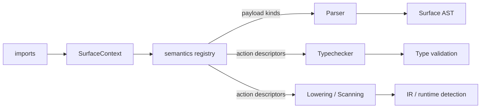

# Incan Compiler Architecture

This document describes the internal architecture of the Incan compiler.

## Compilation Pipeline

This diagram shows the Incan compiler pipeline at a high level.

```bash
┌─────────────────────────────────────────────────────────────────────────────┐
│                                FRONTEND                                     │
├─────────────────────────────────────────────────────────────────────────────┤
│                                                                             │
│     .incn source ──► Lexer ──► Parser ──► TypeChecker ──► AST (typed)       │
│                                                                             │
└────────────────────────────────────┬────────────────────────────────────────┘
                                     │
                                     ▼
┌─────────────────────────────────────────────────────────────────────────────┐
│                                 BACKEND                                     │
├─────────────────────────────────────────────────────────────────────────────┤
│                                                                             │
│   AST ──► AstLowering ──► IR ──► IrEmitter ──► TokenStream ──► Rust source  │
│                                     ▲                                       │
│                                     └──► prettyplease (formatting)          │
│                                                                             │
└────────────────────────────────────┬────────────────────────────────────────┘
                                     │
                                     ▼
┌─────────────────────────────────────────────────────────────────────────────┐
│                       GENERATION + OVEN EXECUTION                            │
├─────────────────────────────────────────────────────────────────────────────┤
│                                                                             │
│  ProjectGenerator ──► caller-owned Rust + receipt ──► Loaf plan ──► rustc  │
│                                                                             │
└─────────────────────────────────────────────────────────────────────────────┘
```

### Glossary

| Term             | Meaning                                                                                                                                          |
| ---------------- | ------------------------------------------------------------------------------------------------------------------------------------------------ |
| Frontend         | Parses `.incn` and typechecks it, producing a typed AST (or diagnostics).                                                                        |
| `.incn` source   | The source code of an Incan program.                                                                                                             |
| Lexer            | Tokenizes source text into tokens (used by the parser). It converts source code into a token stream the parser can understand.                   |
| Parser           | Parses lexer tokens into an AST.                                                                                                                 |
| AST              | The abstract syntax tree (syntax structure + spans for diagnostics).                                                                             |
| Soft keyword     | A keyword that is only reserved after importing a particular stdlib namespace (e.g. `async` / `await` after importing `std.async`).              |
| Typechecker      | Resolves names/imports and checks types, annotating the AST with type information.                                                               |
| Typed AST        | AST after typechecking, with resolved types attached to relevant nodes.                                                                          |
| Backend          | Generates Rust code from the typed AST.                                                                                                          |
| Lowering         | Transforms typed AST → IR (including ownership/mutability/conversion decisions).                                                                 |
| IR               | A Rust-oriented, ownership-aware intermediate representation used for code generation.                                                           |
| IrEmitter        | Emits IR into a Rust `TokenStream` before final formatting.                                                                                      |
| TokenStream      | Rust `TokenStream` from codegen (`proc_macro2` via `quote`/`syn`). This is the final output of the compiler before being formatted to Rust code. |
| prettyplease     | Formats Rust syntax/TokenStream into human-readable Rust source code.                                                                            |
| Rust source      | The generated Rust code as text.                                                                                                                 |
| ProjectGenerator | Writes caller-owned generated Rust and compatibility metadata. Normal build/run/test execution does not delegate to its Cargo compatibility runner. |
| Oven receipt     | Content-derived request binding source, compiler, SDK/provider, target, profile, features, locks, and other build-relevant evidence.              |
| Loaf             | Immutable content-addressed directory containing a verified direct-`rustc` plan, artifacts, identity, provenance, digests, and byte accounting.   |
| Oven store       | Policy-bounded store that selects and leases compatible plans and reports logical, physical, reclaimable, and active-use storage separately.      |
| Cargo            | Rust’s build system and package manager; Oven Alpha confines it to explicit compatibility publication, compiler development, and repository tools. |
| CLI              | Command-line entrypoint for compile/build/run/fmt/test workflows.                                                                                |
| LSP              | IDE server running frontend stages; returns diagnostics/hover/definition via the Language Server Protocol.                                       |
| Runtime crates   | the standard library facets (`incan_std_core`, `incan_std_data`, `incan_std_async`, `incan_std_web`, `incan_std_testing`) and `incan_derive`, used by generated programs (not the compiler).                                                            |

## Walkthrough: `incan build`

This section describes what happens internally when you run `incan build path/to/main.incn`.

```bash
incan build file.incn
  │
  ├──▶ 1) Collect modules (imports)
  │       - Parse the entry file and any imported local modules
  │       - Produces: a list of parsed modules (source + AST) in dependency order
  │
  ├──▶ 2) Type check (with imports)
  │       - Name resolution + type checking across the module set
  │       - Produces: a typed AST (or structured diagnostics)
  │
  ├──▶ 3) Backend preparation
  │       - Scan for feature usage (e.g. serde / async / web / helpers)
  │       - Collect `rust::` crate imports and receipt-bound dependency requirements
  │
  ├──▶ 4) Code generation
  │       - Lower typed AST → ownership-aware IR
  │       - Emit IR → Rust TokenStream → formatted Rust source
  │       - If imports are present: generate a nested Rust module tree
  │
  ├──▶ 5) Generation and receipt
  │       - Write caller-owned generated Rust and compatibility metadata
  │       - Record source, compiler, SDK/provider, target, profile, feature, and lock evidence
  │       - Default output dir: target/incan/<project_name>/
  │
  └──▶ 6) Oven build
          - Select and lease a compatible Loaf from the bounded Oven store
          - Compile the caller-owned root through the verified direct-rustc plan
          - Binary path: target/incan/<project_name>/oven/release/<project_name>
```

Notes:

- **Debugging individual stages**: Use CLI stage flags (`--lex`, `--parse`, `--check`, `--emit-rust`) to inspect intermediate outputs (see [Getting Started](../../tooling/tutorials/getting_started.md)).
- **Multi-file projects**: Import resolution rules and module layout are described in [Imports & Modules](../../language/explanation/imports_and_modules.md).
- **Rust interop dependencies**: `rust::` imports contribute checked dependency requirements. The documented Alpha envelope must already contain compatible sealed artifacts; normal commands do not ask Cargo to resolve a miss (see [Rust Interop](../../language/how-to/rust_interop.md) and [RFC 013]).
- **Runtime boundary**: Generated programs depend on the standard library facets (`incan_std_<component>` under `loaves/stdlib/<component>/rust/`) and `incan_derive`, but the compiler does not.

## Module Layout

```bash
Frontend (turns source text into a typed AST)
  ├──▶ Lexing + parsing
  │     - Converts `.incn` text into an AST
  │     - Attaches spans for precise diagnostics
  ├──▶ Name resolution + type checking
  │     - Builds symbol tables, resolves imports
  │     - Produces a typed AST (or structured errors)
  └──▶ Diagnostics (shared)
        - Pretty, source-context errors used by CLI / Formatter / LSP

Backend (turns typed AST into Rust code)
  ├──▶ Feature scanning
  │     - Detects language features used (serde/async/web/this/etc.)
  │     - Collects required Rust crates / routes / runtime needs
  ├──▶ IR + lowering
  │     - Lowers typed AST to a Rust-oriented, ownership-aware IR
  │     - Central place for ownership/mutability/conversion decisions
  └──▶ Emission + formatting
        - Emits Rust (TokenStream → formatted Rust source)
        - Applies consistent interop rules (borrows/clones/String conversions)

Project generation and Oven execution
  ├──▶ Planning (pure)
  │     - Compute caller-owned generated files, receipt inputs, and output intent
  ├──▶ Execution (side effects)
  │     - Writes generated Rust, selects a compatible Loaf, and invokes direct rustc
  └──▶ Dependency policy
        - Controlled mapping for `rust::` imports; unsupported closures fail without fallback

CLI (user-facing orchestration)
  ├──▶ Compile actions
  │     - build/run: Frontend → Backend → generation → receipt → Oven direct rustc
  ├──▶ Developer actions
  │     - lex/parse/check/emit-rust: inspect intermediate stages
  └──▶ Tool actions
        - fmt: format valid syntax
        - test: discover Incan tests, build one native harness, and execute verified names through Oven

LSP (IDE-facing orchestration)
  ├──▶ Language server
  │     - Runs Frontend (and selected tooling) on edits
  └──▶ Protocol adapters
        - Converts compiler diagnostics into LSP diagnostics (and more over time)

Runtime crates (used by generated Rust programs, not the compiler)
  ├──▶ incan_std_core (mandatory facet: reflection, frozen constants, numerics, strings, collections)
  ├──▶ incan_std_data · incan_std_async · incan_std_web · incan_std_testing
  │      - each component's Rust facet, linked when a program reaches its namespaces
  └──▶ incan_derive
        - Proc-macro derives to generate impls for stdlib traits
```

## Workspace Crate Boundary Policy

Workspace crates are not interchangeable buckets for compiler code. Treat each crate as one of these ownership categories:

- **Stable contract crates**: `incan_lang`, `incan_syntax`, `incan_semantics_core`, and `incan_vocab`. These crates hold shared language contracts used across compiler, tooling, library manifests, and generated-package boundaries. Keep them deterministic, dependency-light, and explicit about what is stable.
- **Compiler/toolchain implementation crates**: `incan_frontend`, `incan_ir`, `incan_emit`, `incan_format`, `incan_provider`, `incan_driver`, `incan_semantics_stdlib`, and `rust_inspect`. These crates own compiler stages, orchestration, stdlib semantics packs, and Rust metadata preparation. They may evolve with the toolchain and should not be treated as general runtime APIs.
- **Runtime-only crates**: the standard library facets (`incan_std_core`, `incan_std_data`, `incan_std_async`, `incan_std_web`, `incan_std_testing`), `incan_derive`, and `incan_web_macros`. These crates back generated Rust programs and runtime behavior. The compiler must not depend on them in normal builds.
- **Transitional runtime surfaces**: the current `incan_std_web` facet plus related macro glue. Keep transitional runtime code quarantined behind runtime-only crates until it is either stabilized or replaced by Incan-authored library code.

The useful distinction is stable contract versus implementation detail, not "more crates" versus "fewer crates." A new crate boundary is justified when it protects a real contract: syntax shared with formatter/LSP, pure semantic policy shared with runtime, a semantics-pack interface, a library manifest ABI, or a staged interop subsystem. It is not justified when it only hides a pile of toolchain internals behind a new package name.

When moving code, preserve these rules:

- Language policy that both compiler and runtime must share belongs in `incan_lang` or another stable contract crate.
- Syntax shapes, parser diagnostics, and AST vocabulary belong in `incan_syntax`; compiler-only name resolution and typechecking stay out of that crate.
- Surface semantics packs return descriptors through `incan_semantics_core`; they do not call compiler frontend/backend code directly.
- Runtime facades, proc macros, web glue, panics, allocation-heavy wrappers, and generated-program helpers stay in runtime-only crates.
- Rust interop metadata loading stays staged and cache-oriented in `rust_inspect`; semantic hot paths should read prepared metadata rather than performing hidden workspace extraction.
- If a type looks stdlib-owned (`Mutex`, `JoinHandle`, `App`, `Response`, etc.), do not add more core-owned surface metadata without an explicit rationale. Prefer library-defined ownership when the current manifest and semantics-pack machinery can express it.

## Semantic Core

Incan has a **semantic core** crate (`incan_lang`) that holds pure, deterministic helpers shared by the compiler and runtime, without creating dependency cycles.

- **Location**: `loaves/kernel/incan_lang`
- **Purpose**: centralize semantic policy and pure helpers so compile-time behavior and runtime behavior cannot drift.
- **Used by**: compiler (typechecker, const-eval, lowering/codegen decisions) and stdlib/runtime helpers.
- **Constraints**: pure/deterministic (no IO, no global state) and no dependencies on compiler crates.
- **Stdlib registry**: `incan_lang::lang::stdlib::STDLIB_NAMESPACES` drives stdlib import validation, stub path resolution, unknown-module hints, and import-activated language features (soft keywords like `async`/`await`).

`incan_lang` should own language-wide policy, not runtime implementations. Existing stdlib-facing surface type metadata is a compatibility boundary; new work should either justify why the metadata is truly language-core policy or push ownership toward library-defined declarations/semantics packs.

See crate-level documentation in `loaves/kernel/incan_lang` for the contract, extension checklist, and drift-prevention expectations; tests in `loaves/compiler/incan_frontend/tests/semantic_core_*` serve as the source of truth for covered domains.

## Syntax Frontend

Incan has a shared **syntax frontend** crate (`incan_syntax`) that centralizes lexer/parser/AST/diagnostics in a dependency-light crate suitable for reuse across compiler and tooling.

- **Location**: `loaves/kernel/incan_syntax`
- **Purpose**: provide a single, shared syntax layer (lexing, parsing, AST, diagnostics) to prevent drift between compiler, formatter, LSP, and future interactive tooling.
- **Used by**: compiler frontend and tooling (formatter/LSP); depends on `incan_lang::lang` registries for vocabulary ids.
- **Constraints**: syntax-only (no name resolution/type checking/IR); no dependencies on compiler crates.

## Repository layout

Every crate lives under `loaves/`, in one of five rings. Dependencies point inward only: `toolchain → compiler → kernel`, `stdlib → kernel`, and the `oven` ring depends on no Incan ring at all. Oven knows nothing about Incan: the compiler ring supplies `incan_oven_facet`, which implements Oven's provider interface, the binaries in `toolchain/` wire the two together, and `compiler/incan_driver` consumes Oven's model and store as a client. `incan_oven_facet` is the one named place Oven learns about Incan; without a named crate the dependency gets drawn wherever is convenient and the property dies quietly. `loaves/` is the one container so the repository root stays stable when a ring is added, split or retired, and the root reads as a project rather than a dependency graph. The workspace root is virtual: there is no root crate, and `cargo test` at the root runs the workspace.

| Ring directory | Current contents and boundary |
| --- | --- |
| `loaves/kernel/` | The language tables and shared semantic helpers in `incan_lang`, the vocabulary contract in `incan_vocab`, and shared syntax, semantics contracts and codegraph records in `incan_syntax`, `incan_semantics_core` and `incan_codegraph`. |
| `loaves/compiler/` | Typechecking (`incan_frontend`), typed IR/lowering (`incan_ir`), Rust emission (`incan_emit`), formatting (`incan_format`), provider operations (`incan_provider`), driver orchestration (`incan_driver`), stdlib semantics packs and Rust inspection. |
| `loaves/oven/` | Project and lock models (`oven_model`), receipts/stores/process containment (`oven_store`), and native planning, execution and Cargo compatibility (`oven_rustc`); `oven_registry`, `oven_interop` and `oven_cargo_compat` are layout skeletons until the Oven inversion (RFC 118) fills them. |
| `loaves/stdlib/` | One directory per standard library component (`sdk-components.toml` is the catalog), each holding its Incan sources under `src/` and, where the component has Rust, its `incan_std_<component>` facet under `rust/`; the derive crates under `derive/`. |
| `loaves/toolchain/` | The binaries: `incan-cli` (the `incan` command, its test runner and the command-line roots) and `incan-lsp` (the language server); `oven-cli` is a layout skeleton until RFC 118 authors `oven` against the Oven API. The workspace root is virtual — there is no root crate. |

Each ring that ships on its own carries its own version line — `oven`, `stdlib` (the facets and the derive crates together) and the vocabulary contract `incan_vocab` — and every other crate inherits the workspace version, which is the toolchain's. Cross-ring edges are semver requirements written beside the crate's path in the root `[workspace.dependencies]` table, never equalities; `scripts/check_ring_versions.py` keeps the lines and the table consistent. The compiler ring does not link the runtime it generates for, so the emitter declares the stdlib line it generates code for (`incan_emit::GENERATED_FOR_STDLIB_VERSION`), and generated code checks the stdlib it links against that declaration as a compatibility range, not as an exact compiler version.

Names follow the ring: `incan_<thing>` for kernel and compiler crates, `oven_<thing>` for the build system, `incan_std_<component>` for standard library facets (matching the `stdlib-<component>` ids in `sdk-components.toml`). Binaries keep their product names, `incan` and `incan-lsp`, and their directories say what they are, `incan-cli` and `incan-lsp`. The word `core` names the mandatory standard library component and nothing else; the language crate is `incan_lang`.

Only the standard library has both languages: each component directory holds its Incan sources under `src/` and its Rust facet under `rust/` as one Loaf with a conventional Rust facet, as RFC 119 spells a mixed root. The compiler and Oven rings are Rust-only.

The ring rule is checked rather than trusted. `make check-oven-ring` (`scripts/check_oven_ring.py`, a CI step) checks the `oven_*` crates in a workspace that holds nothing else, so an `incan_*` import in Oven fails to resolve; `cargo check -p incan_driver --no-default-features` and `cargo check -p incan-lsp --no-default-features --lib --bin incan-lsp` prove the compiler ring and the language server build without the CLI; and `loaves/toolchain/incan-cli/tests/layering_guard.rs` refuses a standard library facet in the `[dependencies]` of a kernel- or compiler-ring manifest.

`incan_frontend` reexports syntax from `incan_syntax` and owns module resolution, symbol tables, typechecking, checked library-manifest records and provider-plan contracts. `incan_provider` consumes those contracts for SDK discovery, building and dependency resolution. `incan_driver` composes the compilation session and build workflow; the CLI and LSP consume its services. These are separate crates rather than subdirectories of a monolithic frontend/backend module.

## Surface Semantics Engine

Surface syntax features (soft keywords, decorator semantics) are fully driven by a **semantics registry**. Every compiler stage — parser, typechecker, lowering, and scanning — consults the registry instead of hardcoding keyword identities. The design separates *feature knowledge* (which keyword does what) from *execution knowledge* (how the compiler performs each action):



### Action descriptors

Packs don't execute compiler logic directly (that would create circular dependencies). Instead, they return small **action descriptor** enums that tell the compiler *what to do*:

| Enum                        | Variants (current)     | Used by     | Purpose                                         |
| --------------------------- | ---------------------- | ----------- | ----------------------------------------------- |
| `SurfaceStmtLoweringAction` | `AssertCall`           | Lowering    | Describes how to lower a surface statement      |
| `SurfaceExprLoweringAction` | `Await`                | Lowering    | Describes how to lower a surface expression     |
| `SurfaceStmtTypeCheck`      | `AssertCheck`          | Typechecker | Describes how to typecheck a surface statement  |
| `SurfaceExprTypeCheck`      | `AwaitCheck`           | Typechecker | Describes how to typecheck a surface expression |
| `RuntimeRequirement`        | `None`, `AsyncRuntime` | Scanning    | Runtime implied by a modifier or import         |

Multiple keywords can share the same action descriptor (e.g., a hypothetical `ensure` keyword could reuse `AssertCall`). Adding a keyword that fits an existing action pattern is a **pack-only change** — zero touches to the main compiler crate.

### Core pieces

- `loaves/kernel/incan_semantics_core`
    - Defines stable `SurfaceFeatureKey` ids and payload categories used by parser/typechecker/lowering.
    - Defines the action descriptor enums listed above.
    - Defines `SurfaceSemanticsPack` trait (full compiler-stage coverage) and `SurfaceSemanticsRegistry`.
- `loaves/compiler/incan_semantics_stdlib`
    - Implements stdlib semantics pack(s) for `assert`, `async`, `await`, and stdlib decorator families.
    - Returns action descriptors for each compiler stage, gated by Cargo features (`std_testing`, `std_async`).
    - Exposes canonical call targets (e.g., `std.testing.assert_*`) and runtime requirements.
- `loaves/compiler/incan_frontend/src/surface_semantics.rs`
    - Builds `SurfaceContext` from imports and aliases.
    - Provides import-driven soft-keyword activation and registry queries.
- `loaves/compiler/incan_frontend/src/typechecker/check_stmt.rs` and `loaves/compiler/incan_frontend/src/typechecker/check_expr/mod.rs`
    - `check_surface_stmt()` and `check_surface_expr()` query the registry for typecheck action descriptors and dispatch on the returned action — no `KeywordId` matching.
- `loaves/compiler/incan_ir/src/lower/stmt.rs` and `loaves/compiler/incan_ir/src/lower/expr/mod.rs`
    - `lower_surface_statement()` and the `Expr::Surface` arm of `lower_expr()` query the registry for lowering action descriptors and dispatch on the returned action — no `KeywordId` matching.
- `loaves/kernel/incan_syntax/src/scanners/runtime.rs`
    - Detects async runtime requirement by asking the registry about each import and each surface modifier — no hardcoded module names or keyword checks.
- `loaves/compiler/incan_ir/src/surface_semantics.rs`
    - Thin helpers for action execution (assert condition decomposition, await IR wrapping).
- `loaves/compiler/incan_ir/src/expr.rs` (`IrExprKind::Call`)
    - Carries optional canonical callee path metadata.
    - Lets emission resolve stdlib calls independent of local import style.

### Feature gating

Feature gating is compile-time and crate-level:

- `std_testing`, `std_async`, and `std_decorators` enable pack capabilities through Cargo features.
- When disabled, the corresponding semantics handlers are not compiled into the `incan` artifact.

### Adding a new soft keyword or decorator

If the new keyword fits an existing action pattern, only steps 1–3 require code changes:

1. Add activation metadata in `incan_lang::lang` registry tables (`KeywordId` + `info_soft()`).
2. Implement the relevant `SurfaceSemanticsPack` methods in `incan_semantics_stdlib` (or another pack crate): parser routing, typecheck action, lowering action, runtime requirements, and call targets as needed.
3. Ensure parser emits generic surface payload with `SurfaceFeatureKey` handoff (usually automatic via existing parser helpers).
4. **Typechecker / Lowering / Scanning**: no changes needed — the registry returns the action descriptor and the existing dispatch handles it.
5. Handle the new surface node in the **formatter** (usually a one-liner).
6. Add parser/typechecker/codegen tests and update snapshots.

If the keyword needs a *new* compiler behavior pattern, add a variant to the relevant action descriptor enum in `incan_semantics_core` and a handler arm in the corresponding compiler module. This is deliberately rare — action descriptors represent compiler behavior patterns, not individual keywords.

### Lowering, emission and generation

`loaves/compiler/incan_ir/src/` owns IR declarations, expressions, statements and types, plus AST lowering in `lower/`. Its borrow inference records proven ownership shapes. `loaves/compiler/incan_emit/src/` consumes that IR: `codegen.rs` coordinates lowering and emission, `emit/` writes Rust syntax, and `ownership.rs`, `conversions.rs` and `trait_bound_inference.rs` keep use-site materialization and generated generic bounds aligned.

Project generation lives in `loaves/compiler/incan_driver/src/backend/project/`. It combines compiler and provider facts into caller-owned generated Rust and receipt inputs. Oven's native plan selection and execution live in `loaves/oven/oven_rustc/src/`; the generated-project compatibility helpers have not become an independent Cargo-compatibility crate.

### Rust inspect subsystem (`loaves/compiler/rust_inspect/`)

`rust_inspect` is a staged interop subsystem for checks that need Rust-side signatures and item shapes. It is toolchain-locked implementation code, not a stable language contract crate.

| Module         | Purpose                                                              |
| -------------- | -------------------------------------------------------------------- |
| `lib.rs`, `inspector.rs` | Public exports and orchestration of metadata retrieval          |
| `cache.rs`     | Workspace-scoped in-memory cache for extracted Rust item metadata    |
| `loader.rs`    | Rust workspace loading and crate graph setup for metadata extraction |
| `extractor.rs` | rust-analyzer-backed extraction of item signatures and method shapes |
| `error.rs`     | Typed metadata load/extract error surface                            |

Keep Rust inspection as explicit preparation followed by cache reads. CLI/LSP/project setup may prepare the inspection workspace and prewarm metadata; parser/typechecker/lowering paths should not silently trigger expensive Rust workspace loading.

#### Expression Emission (`loaves/compiler/incan_emit/src/emit/expressions/`)

The expression emitter is split into focused submodules for maintainability:

| Submodule           | Purpose                                          |
| ------------------- | ------------------------------------------------ |
| `mod.rs`            | `emit_expr` entry point and dispatch             |
| `builtins.rs`       | Builtin calls (`print`, `len`, `range`, etc.)    |
| `methods.rs`        | Known methods + fallback method calls            |
| `calls.rs`          | Function calls and binary operations             |
| `indexing.rs`       | Index/slice/field access                         |
| `comprehensions.rs` | List and dict comprehensions                     |
| `structs_enums.rs`  | Struct constructors and enum-related expressions |
| `format.rs`         | f-strings and range expressions                  |
| `lvalue.rs`         | Assignment targets                               |

**Enum-based dispatch**: Built-in functions and known methods use enum types (`BuiltinFn`, `MethodKind`) instead of string matching. This provides compile-time exhaustiveness checking and makes it easier to add new builtins/methods (see [Extending Incan](../how-to/extending_language.md)).

### CLI (`loaves/toolchain/incan-cli/src/`)

| Module           | Purpose                                   |
| ---------------- | ----------------------------------------- |
| `commands/` | Command handlers (`build`, `run`, `fmt`)  |
| `test_runner/` | Test harness execution and reporting; shared discovery is in the driver |
| `commands/stdlib_loader.rs` | Stdlib loading for commands   |

### Tooling

| Module    | Purpose                               |
| --------- | ------------------------------------- |
| `loaves/compiler/incan_format/src/` | Source formatter                      |
| `loaves/toolchain/incan-lsp/src/` | LSP backend logic (diagnostics/hover) and the `incan-lsp` binary (`main.rs`) |

## Key Data Types

```text
AST (frontend)          IR (backend)              Rust (output)
─────────────────       ──────────────────        ─────────────────
ast::Program       ──►  IrProgram            ──►  TokenStream
ast::Declaration   ──►  IrDecl               ──►  (syn Items)
ast::Statement     ──►  IrStmt               ──►  (syn Stmts)
ast::Expr          ──►  TypedExpr            ──►  (syn Expr)
ast::Type          ──►  IrType               ──►  (syn Type)
```

## Ownership & Data Flow

1. **Frontend** parses and typechecks, producing an owned `ast::Program`
2. **Backend** borrows `&ast::Program`, produces owned `IrProgram`
3. **Emitter** borrows `&IrProgram`, produces owned `TokenStream`
4. **prettyplease** formats `TokenStream` to `String`
5. **ProjectGenerator** writes caller-owned generated files and compatibility metadata
6. **Oven** selects a receipt-compatible Loaf, retains its lease, and invokes the verified direct-`rustc` plan

## Entry Points

- **CLI**: `loaves/toolchain/incan-cli/src/main.rs` → `incan_cli::run()`
- **Codegen**: `IrCodegen::new()` → `.generate(&ast)`
- **LSP**: `loaves/toolchain/incan-lsp/src/main.rs`

## Extending the Language

Incan’s compiler is intentionally staged (Lexer → Parser/AST → Typechecker → IR → Rust). This makes the system easier to reason about, but it also means “language changes” can touch multiple layers.

For contributor guidance on **when to add a builtin vs when to add new syntax**, plus end-to-end checklists, see:

- [Extending Incan: Builtins vs New Syntax](../how-to/extending_language.md)

--8<-- "_snippets/rfcs_refs.md"
