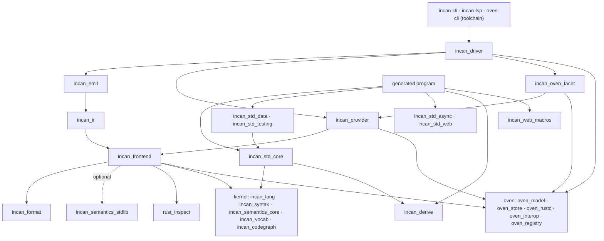

# Layering Rules

This repository follows a strict dependency direction to keep semantics shared and prevent accidental drift between the compiler and the runtime. The crates live in five rings under `loaves/` (see *Repository layout* in [Architecture](architecture.md)); the direction runs kernel → oven → compiler → toolchain, with the standard library beside them:

- The **kernel** ring (`incan_lang`, `incan_syntax`, `incan_semantics_core`, `incan_vocab`, `incan_codegraph`) depends on nothing outside itself; `incan_lang` and `incan_vocab` depend on nothing at all.
- The **oven** ring (`oven_model`, `oven_store`, `oven_rustc`, `oven_interop`, `oven_registry`) depends on nothing outside itself; within it, `oven_interop` sits over `oven_rustc`. It knows Incan by name only — the compiler's provider interface is implemented in `incan_oven_facet`, on the compiler side of the seam.
- The **compiler** ring (`incan_frontend`, `incan_ir`, `incan_emit`, `incan_format`, `incan_provider`, `rust_inspect`, `incan_driver`, `incan_oven_facet`, `incan_semantics_stdlib`) depends on the kernel and, for the build orchestration, on the oven ring. Within the ring, `incan_ir` depends on `incan_frontend`, `incan_emit` on both, and `incan_driver` on all three plus `incan_provider` and `incan_oven_facet`.
- The **toolchain** ring (`incan-cli`, `incan-lsp`, `oven-cli`) is the only place that depends on the driver; nothing outside the ring depends on it (`incan-cli` depends on `oven-cli` for the commands it mounts).
- No compiler-ring or kernel-ring crate depends on a standard library facet (`incan_std_core` and the other `incan_std_<component>` crates) except as a **dev-dependency** for parity tests.
- Among the facets, `incan_std_core` depends on `incan_lang` and `incan_derive`; `incan_std_data` and `incan_std_testing` depend on `incan_std_core`; `incan_std_async` and `incan_std_web` stand alone.
- Generated user programs depend on `incan_std_core` and on whichever other facets their namespaces reach.

CI/Test guardrails enforce that the compiler and kernel rings keep the facets out of their normal dependencies. If you need runtime helpers inside tests, add them under `[dev-dependencies]` only.

## Workspace crate categories

Use this policy when deciding where new code belongs:

- **Stable contracts**: the kernel ring — `incan_lang`, `incan_syntax`, `incan_semantics_core`, `incan_vocab` and `incan_codegraph`. Other layers build on these crates. Keep them deterministic, dependency-light, and free of runtime side effects.
- **Build tool**: the oven ring — `oven_model`, `oven_store`, `oven_rustc`, `oven_interop`, `oven_registry` (and the `oven_cargo_compat` skeleton). Manifests, the store, direct-rustc units, native interop; nothing Incan-specific beyond the runtime-crate naming rule.
- **Compiler/toolchain implementation**: the compiler ring — `incan_frontend`, `incan_ir`, `incan_emit`, `incan_format`, `incan_provider`, `rust_inspect`, `incan_driver`, `incan_oven_facet`, `incan_semantics_stdlib` — and the toolchain ring's three packages. These crates are tied to the current compiler/tooling. They may depend on stable contracts but should not become runtime APIs.
- **Runtime-only implementation**: the standard library facets (`incan_std_core`, `incan_std_data`, `incan_std_async`, `incan_std_web`, `incan_std_testing`), `incan_derive`, and `incan_web_macros`. Generated Rust programs use these crates. The compiler may generate references to them but must not depend on them in normal builds.
- **Transitional runtime surfaces**: the current `incan_std_web` facet and related macro glue. This runtime code is not yet a stable long-term contract. Keep it quarantined and avoid treating it as compiler-owned policy.

## Why we do this

We want one “source of truth” for language behavior so the compiler and runtime don’t drift:

- **Semantics must match**: if const-eval validates something, runtime should do the same thing the same way (especially for Unicode-sensitive string operations and numeric edge cases).
- **Diagnostics/panics must stay aligned**: user-facing error messages should not diverge between compile-time and runtime.
- **Compiler stays lean**: the compiler shouldn’t accidentally pull in runtime-only APIs or heavy dependencies.

## What goes where (contracts vs implementations)

**`incan_lang`**:

- Pure helpers that define *meaning/policy* (e.g., string indexing/slicing rules, numeric promotion, canonical error message constants).
- Central registries for language vocabulary and stdlib wiring (for example `incan_lang::lang::stdlib::STDLIB_NAMESPACES` and keyword metadata used by the lexer/parser).
- Must be deterministic and side-effect free.
- Should not depend on compiler internals (AST, spans, lexer/parser state).
- Should not gain new stdlib-owned runtime surface types unless the type metadata is truly shared language policy.

**`incan_syntax`**:

- Lexer, parser, AST, and syntax diagnostics shared by compiler, formatter, LSP, and future tooling.
- May use language vocabulary from stable contract crates.
- Must not perform name resolution, typechecking, lowering, Rust interop loading, or runtime behavior.

**`incan_semantics_core`**:

- Stable action-descriptor and semantics-pack contracts that compiler stages can consume.
- Owns behavior descriptors, not compiler execution. Packs describe what to do; compiler stages decide how to do it.

**`incan_semantics_stdlib`**:

- Stdlib semantics-pack implementation for current built-in library surfaces.
- Toolchain-locked implementation crate, not a stable external API.
- Should return descriptors and canonical targets instead of reaching into compiler internals.

**`rust_inspect`**:

- Dedicated Rust metadata preparation, extraction, and caching subsystem.
- Allowed behind compiler/tooling features for Rust interop.
- Should remain explicit and staged: prepare/prewarm metadata at CLI/LSP/project boundaries, then read cached metadata in semantic paths.

**The standard library facets (`incan_std_core`, `incan_std_data`, `incan_std_async`, `incan_std_web`, `incan_std_testing`)**:

- Runtime helpers used by generated Rust code, one crate per stdlib component that has Rust beside its Incan sources (`loaves/stdlib/<component>/rust/`); `incan_std_core` is mandatory and serves the language itself, the others serve their component's namespaces.
- Should delegate behavior to `incan_lang` for policy/consistency, and implement runtime-only actions (like panicking) using the shared error messages/taxonomy.
- May contain transitional implementation modules, but those modules must not become compiler dependencies.

**`incan_derive` / `incan_web_macros`**:

- Runtime-side macro support for generated Rust programs.
- Must not become a backchannel for compiler logic.
- Web macro/runtime glue is transitional until the web surface has a stable long-term ownership model.

**The compiler ring (`incan_frontend`, `incan_ir`, `incan_emit`, `incan_driver` and their neighbours)**:

- Typing (`incan_frontend`), lowering (`incan_ir`), codegen (`incan_emit`), formatting (`incan_format`), provider and SDK contracts (`incan_provider`), and the build session that drives them (`incan_driver`); diagnostics are catalogued in `incan_syntax`.
- May use stable contract crates to implement checks/const-eval and to keep error text aligned, and the oven ring to plan and run builds.
- Must not use runtime-only crates in normal builds; only `incan_std_core` as a dev-dependency for parity tests.

## Allowed / forbidden dependencies

**Allowed**:

- a compiler-ring crate → `incan_lang`, `incan_syntax`, `incan_semantics_core`, `incan_semantics_stdlib`, `incan_vocab`, `incan_codegraph` as normal dependencies.
- a compiler-ring crate → `oven_model`, `oven_store`, `oven_rustc`, `oven_interop` where it plans or runs builds (`incan_driver`, `incan_provider`, `incan_oven_facet`; `incan_frontend` and `incan_emit` for the manifest and receipt types).
- a compiler-ring crate → `rust_inspect` behind the Rust interop path.
- a facet → `incan_lang` (and `incan_std_data` or `incan_std_testing` → `incan_std_core`) as normal dependencies.
- a compiler-ring crate → `incan_std_core` as a dev-dependency only, for tests.

**Forbidden**:

- a compiler-ring or kernel-ring crate → any facet in `[dependencies]` (this breaks layering).
- a compiler-ring crate → `incan_derive` or `incan_web_macros` in normal dependencies.
- a kernel-ring crate → any compiler-ring, oven-ring, toolchain-ring or runtime crate.
- an oven-ring crate → any Incan crate; what Oven needs to know about Incan enters through `incan_oven_facet`.
- Runtime crates calling back into compiler crates.

## Common pitfalls

- Adding a “quick helper” in a facet and calling it from the compiler.
    - Fix: move the policy/logic to `incan_lang` and keep only runtime glue (panics, wrappers) in the facet.

- Adding another stdlib-specific surface type to `incan_lang` because similar metadata already exists there.
    - Fix: decide whether the type is true language policy or library-owned surface. Prefer library-defined ownership when possible, and document the exception when it must stay core-owned.

- Emitting direct Rust operations that bypass shared semantics (e.g., slicing Rust `String` by byte indices).
    - Fix: emit calls to `incan_std_core` wrappers which themselves delegate to `incan_lang`.

- Duplicating error messages as string literals in multiple places.
    - Fix: put canonical text in `incan_lang` and reuse it from both compiler and runtime.

- Loading Rust metadata opportunistically from typechecking or lowering.
    - Fix: prewarm through the explicit `rust_inspect` preparation path and keep semantic lookups cache-oriented.

## Guardrails (how it is enforced)

- **Dependency gate**: `loaves/toolchain/incan-cli/tests/layering_guard.rs` fails if a facet appears in the `[dependencies]` section of the root, compiler-ring or kernel-ring manifests (keeping one in `[dev-dependencies]` for parity tests is allowed), if the registry's facet facts disagree with `sdk-components.toml` and the crates on disk, or if the compiler ring spells a runtime crate the catalog does not know.

## How to add shared behavior safely

When you notice drift risk (compiler vs runtime):

1. Put the *policy* in `incan_lang` (pure function + typed error or canonical message).
2. Add a thin wrapper in the owning facet (`incan_std_core` for language runtime) that calls semantics and performs runtime-only behavior (panic, allocation, conversions).
3. Update compiler const-eval / typechecking to use the semantics helper directly (never stdlib).
4. Add a parity test in the owning ring's integration roots (the frontend's `semantic_core_parity` roots under `loaves/compiler/incan_frontend/tests/`, or `incan_emit`'s codegen roots) that compares compiler/semantics/runtime behavior for the edge case.
