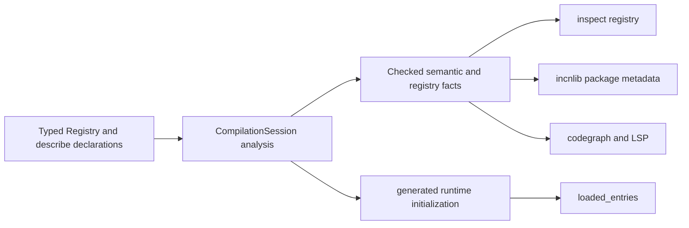

# Checked catalogues and loaded registries

`std.registry` deliberately exposes one declaration catalogue through two views. The distinction prevents a running process from pretending it has loaded an entire package and prevents static tools from executing user code merely to discover declarations.

## One source of truth, two projections

A registry definition and its description sites are the source authority. Type checking validates their identities, subject kinds, key and descriptor types, duplicate rules, and structural values. After that shared analysis, the compiler projects the same facts in two directions:

The checked projection is complete for the selected source package and its compatible dependency artifacts. The loaded projection is bounded by module initialization in one process. They share declaration authority but answer different questions.

## Why runtime loading cannot prove completeness

Runtime registries are useful for dispatch, plugin selection, command execution, and other work that acts on code already present in a process. They are not a reliable documentation or architecture inventory:

- an entry may live in a module that the process never imported;
- initialization order can vary;
- loading a module may perform work that inspection must not trigger;
- dependency artifacts may be available even when their source and runtime environment are not.

For those reasons, the runtime method is named `loaded_entries()`. The name makes the boundary visible at the call site.

## Why checked inspection does not execute modules

`incan inspect registry` consumes the compiler's checked projection. Descriptor values must therefore be structural and knowable without evaluation. Primitive values, validated newtypes, fieldless enums, concrete type tokens, nested descriptor models, `Option`, `FrozenList`, and `FrozenDict` fit that contract. Mutable collections, functions, native handles, open generics, and recursive descriptor graphs do not.

This restriction is intentional. It makes inspection deterministic, allows `.incnlib` artifacts to carry the same facts, and lets editors and agents use source anchors without importing application code.

## Domain ownership stays outside the registry

`std.registry` owns association and discovery, not the vocabulary of every domain. A command library can define `CommandSpec`; a data library can define `FunctionSpec`; a policy library can define `PolicySpec`. This avoids turning `@describe` into a growing list of loosely related keyword arguments.

The same boundary prevents metadata monoculture. Registry membership does not grant runtime authority, emit receipts, define package dependencies, or replace checked model contracts. Those meanings remain with their owning domains.

## Reexports are projections, not registrations

A public facade may give a registry or described declaration another import path. The checked metadata records that path with its source anchor, while the canonical entry continues to point at the original registry and subject. Treating a reexport as a new entry would create duplicate keys and make ownership depend on packaging style.

## Package artifacts preserve the boundary

When a library is built, its public registry definitions and entries are embedded in the checked `.incnlib` contract metadata. A consumer can inspect those facts without the producer's source tree. Private registries remain visible to their defining source package but are not published as dependency API.

The metadata has an explicit schema version and provenance. A future runtime observation can therefore be represented without being mistaken for a checked declaration.

## Relationship to compilation sessions

Registry inspection, codegraph export, package publication, lowering, and test batches must consume artifacts from the same compilation analysis. If each command reran typechecking or reparsed decorators independently, they could disagree about imports, aliases, package identity, or feature selection. `CompilationSession` keeps those inputs and checked products together; registry consumers project from that shared result.

See the [typed-registry tutorial](../tutorials/typed_registries.md) to build a catalogue, the [how-to guide](../how-to/typed_registries.md) for migration and package workflows, and the [`std.registry` reference](../reference/stdlib/registry.md) for exact contracts.
