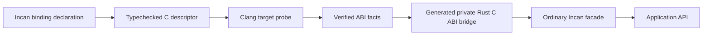

# How checked C interop is structured

Checked C interop is a language-owned contract for a deliberately small foreign boundary. It is not a header importer, an ambient linker search, or a claim that C pointers already have Incan ownership semantics.

## One declaration authority

The binding source is the authority for the Incan-facing names, C scalar categories, native spellings, ownership and output contracts, and supported plain layouts. The compiler uses the declaration to construct a target-specific C probe; it does not scrape a header to invent a public API or infer safety from generated Rust.

The probe is syntax-only. It checks free-function signatures, folds declared enum constants, and checks requested plain-structure size, alignment, and field offsets for the selected host ABI. It neither links the native library nor executes its code. The later generated build still links the system library named by `c.system_library("name")`.

## Inspection is a projection, not another authority

[`incan inspect bindings`](../../tooling/how-to/inspect_checked_c_bindings.md) runs the ordinary checked compilation analysis and projects its binding descriptors for people and tools. It does not reparse vocabulary syntax, scrape headers, or interpret generated Rust. An invalid declaration therefore produces the normal compiler diagnostic instead of a plausible-looking partial report.

The declaration projection deliberately does not absorb facts with different lifecycles:

| Surface | Question it answers |
| --- | --- |
| Binding inspection | What ABI, ownership, output, enum, and layout contract did the compiler accept from this source graph? |
| `[oven.interop]` and `incan.lock` | What target requirements and package-owned physical inputs did the author declare and lock? |
| Future Oven receipt and store | Which concrete toolchain, SDK, artifacts, commands, and shim outputs satisfied those requirements? |
| Future editor and codegraph projections | Where are raw declarations, private bridges, and public façades related in source? |

Keeping these projections separate prevents a source inspection from being mistaken for evidence that an artifact was resolved, a shim was built, or a mobile package is ready. They can still share stable binding identities as the tooling vertical grows.

## Why the boundary begins with C declarations

C is an ABI, not a complete ownership model. A header can expose an integer function accurately while saying little about which pointer owns a resource, when a callback expires, or how a caller must size an output buffer. Pretending that a foreign declaration is already a safe Incan API would hide those decisions at exactly the wrong boundary.

The current surface adds one narrow ownership model without widening into general pointers. A binding may declare an opaque resource, one matching release operation, and whether each call consumes, shares, or mutably borrows that resource. It may also declare scalar and owned-resource output positions. These are compiler-owned call facts: the source does not expose raw addresses, and generated Rust does not infer ownership from its own requirements. The façade above the binding remains responsible for input validation, native status interpretation, error models, retries, and cancellation.

## C interop and Rust interop solve different problems

Neither choice is universally better:

| Choose | When it is the better fit today |
| --- | --- |
| Checked C binding | The supported foreign boundary is a small, stable C ABI whose scalar calls, opaque handles, and output positions can be declared and verified exactly. |
| Rust interop | A maintained Rust crate already exposes the safe API you need, especially for resources, callbacks, async work, collections, or richer types. |
| A future checked shim | The underlying C API is real but needs an adapter for callbacks, variadics, function tables, bitfields, unions, or lifetime relationships. |

The language in which a library happens to be implemented is not decisive. A C++ engine, a Python extension, or a Rust library may intentionally publish a C ABI; a Rust wrapper can still be preferable when it owns difficult safety and build concerns well. Conversely, a small C ABI can be clearer and more durable than a wrapper when it is the producer's published contract.

## What is deliberately not claimed yet

The checked boundary does not resolve interop artifacts, compile C/C++ shims, provision Android or Apple targets, or hand application assemblies to Gradle and Xcode. It also does not make `c.system_library("name")` a portable library-discovery mechanism. Those jobs need target-specific artifact identity and packaging facts, which are distinct from the source ABI declaration.

A package can declare target-specific, package-relative headers, static or bundled artifacts, system capabilities, C/C++ shim sources, and compatible toolchain or SDK capabilities under `[oven.interop]` in `incan.toml`; `incan lock` then records those normalized requirements and the content-derived identities of package-owned files. The declaration is intentionally binding-kind-neutral, so a future JNI, Python-extension, or other interop entry point can consume the same package-level evidence without replacing the language binding as ABI authority.

That is an Oven requirement and locking boundary, not a claim that a build has already selected or produced anything. This slice does not perform host discovery, download inputs, compile a shim, select a concrete compiler or SDK, choose a final Android/iOS deployment layout, or interpret publication signing and licence policy. Oven will own managed resolution, verification, baking, caching, staging, its concrete build receipt, and a directionally useful deployment plan; Gradle and Xcode remain final application assembly and signing consumers. The exact handover interface remains an associated RFC concern rather than a promise frozen into this experimental surface.

The same restraint still applies to views and general pointers. `c.cstr(value)?` is the one deliberately bounded exception: it creates temporary NUL-terminated input storage and exposes an exact const-character pointer only within `unsafe:` for a matching raw C contract. Returned C strings, spans, caller-owned buffers, scoped foreign views, arbitrary pointer operations, and context-manager syntax still need additional lifetime and bounds contracts. Opaque resources and output storage remain private compiler-managed carriers, while public APIs use ordinary Incan values.

For a working first binding, start with the [tutorial](../tutorials/checked_c_binding.md). For declaration recipes and diagnostics, use the [binding how-to](../how-to/checked_c_bindings.md). To review what the compiler accepted, use the [inspection how-to](../../tooling/how-to/inspect_checked_c_bindings.md). The [`std.interop` reference](../reference/stdlib/interop.md) is the exact syntax and capability contract.
