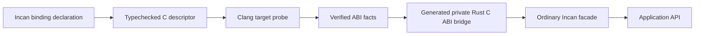

# How checked C interop is structured

Checked C interop is a language-owned contract for a deliberately small foreign boundary. It is not a header importer, an ambient linker search, or a claim that C pointers already have Incan ownership semantics.

## One declaration authority

The binding source is the authority for the Incan-facing names, C scalar categories, native spellings, and supported plain layouts. The compiler uses the declaration to construct a target-specific C probe; it does not scrape a header to invent a public API or infer safety from generated Rust.

```mermaid
flowchart LR
  S["Incan binding declaration"] --> T["Typechecked C descriptor"]
  T --> V["Clang target probe"]
  V --> R["Verified ABI facts"]
  R --> L["Generated private Rust C ABI bridge"]
  L --> F["Ordinary Incan facade"]
  F --> A["Application API"]
```

The probe is syntax-only. It checks free-function signatures, folds declared enum constants, and checks requested plain-structure size, alignment, and field offsets for either the host ABI or an explicitly selected package-native target. It neither links the native library nor executes its code. The later generated build still links the system library named by `c.system_library("name")`.

## Why the boundary begins with C declarations

C is an ABI, not a complete ownership model. A header can expose an integer function accurately while saying little about which pointer owns a resource, when a callback expires, or how a caller must size an output buffer. Pretending that a foreign declaration is already a safe Incan API would hide those decisions at exactly the wrong boundary.

The current surface adds one narrow ownership model without widening into general pointers. A binding may declare an opaque resource, one matching release operation, and whether each call consumes, shares, or mutably borrows that resource. It may also declare scalar and owned-resource output positions. These are compiler-owned call facts: the source does not expose raw addresses, and generated Rust does not infer ownership from its own requirements. The façade above the binding remains responsible for input validation, native status interpretation, error models, retries, and cancellation.

## C interop and Rust interop solve different problems

Neither choice is universally better:

| Choose | When it is the better fit today |
| --- | --- |
| Checked C binding | The supported foreign boundary is a small, stable C ABI whose scalar calls, opaque handles, and output positions can be declared and verified exactly. |
| Rust interop | A maintained Rust crate already exposes the safe API you need, especially for resources, callbacks, async work, collections, or richer types. |
| A future checked shim | The underlying C API is real but needs an adapter for callbacks, variadics, function tables, bitfields, unions, or lifetime relationships. |

The language in which a library happens to be implemented is not decisive. A C++ engine, a Python extension, or a Rust library may intentionally publish a C ABI; a Rust wrapper can still be preferable when it owns difficult safety and build concerns well. Conversely, a small C ABI can be clearer and more durable than a wrapper when it is the producer's published contract.

## What is deliberately not claimed yet

The checked boundary does not resolve native artifacts, compile C/C++ shims, cross-compile generated Rust, or hand application assemblies to Gradle and Xcode. It also does not make `c.system_library("name")` a portable library-discovery mechanism. Those jobs need target-specific artifact identity and packaging facts, which are distinct from the source ABI declaration.

The native-input declaration records those facts without taking over their later jobs. A package can declare target-specific, package-relative headers, static or bundled artifacts, system capabilities, C/C++ shim sources, and a mobile platform version in `incan.toml`; `incan lock` then records content-derived receipts for those inputs. Android arm64 records its NDK API level, while iOS arm64 records its deployment target. The declaration is intentionally binding-kind-neutral, so a future JNI, Python-extension, or other native entry point can consume the same package-level evidence without replacing the language binding as ABI authority.

`incan check --native-target <triple>` connects one declared mobile profile to the source ABI verifier. Android API levels and iOS deployment targets become part of Clang's exact target triple, and the selected target's preprocessor definitions apply to every probe. The command still stops at syntax and layout verification. Android currently needs an explicitly provisioned NDK Clang executable, while iOS uses the selected Xcode iPhoneOS SDK; neither path yet attests the installed toolchain or SDK against the manifest's logical identity.

`incan inspect native-plan --target <triple>` projects one current locked target into the first versioned platform handoff. The plan contains package-relative receipts, include roots, definitions, dependency-ordered static links, bundled placements and runtime names, explicit system capabilities, shim build inputs and logical outputs, platform constraints, and provenance. This is enough for a Gradle or Xcode adapter to consume the same physical facts without users repeating them in platform configuration, while keeping those tools responsible for their own task and command protocols.

That remains a declaration, verification, and planning boundary, not a native build system or a platform packager. It does not download inputs, compile a shim, cross-compile generated Rust, stage a final Android/iOS application, resolve symbols at link time, or interpret publication signing and licence policy. Oven will eventually own managed resolution, toolchain attestation, verification, baking, caching, staging, and Loaf production; Gradle and Xcode remain final application assembly and signing consumers.

The same restraint still applies to views and general pointers. C strings, spans, caller-owned buffers, scoped foreign views, arbitrary pointer operations, and context-manager syntax need additional lifetime and bounds contracts. The current guarantee is deliberately smaller: opaque resources and output storage remain private compiler-managed carriers, while public APIs use ordinary Incan values.

For a working first binding, start with the [tutorial](../tutorials/checked_c_binding.md). For declaration recipes and diagnostics, use the [how-to guide](../how-to/checked_c_bindings.md). The [`std.interop` reference](../reference/stdlib/interop.md) is the exact syntax and capability contract.
