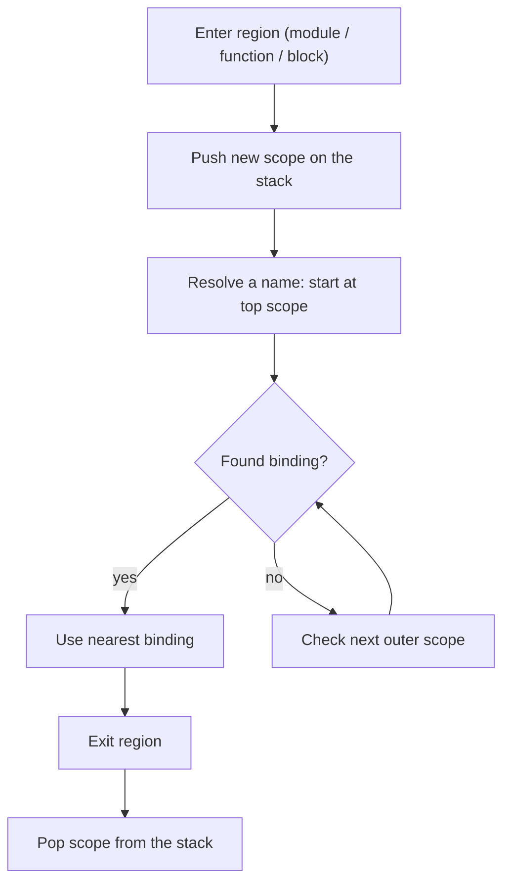

# Scopes & Name Resolution

Incan is **lexically scoped**: a name refers to the *nearest* binding in the surrounding source structure.

Two rules matter most in day-to-day code:

- Incan has **block scope**: most indented blocks introduce a new scope.
- Incan’s “plain assignment” (`x = ...` without `let`/`mut`) is **inferred**:
    - If `x` already exists in an enclosing scope, `x = ...` is a **reassignment** (so it requires `x` to be `mut`).
    - If `x` does not exist yet, `x = ...` creates a **new binding** in the current scope.

This page explains how those rules interact, and how to write clear, predictable code.

## Mental model

Think of the compiler keeping a **stack of scopes**. When you enter a new syntactic region (module, function, block, …) it pushes a scope; when you leave it pops the scope. Name lookup walks from the top of the stack outward until it finds a match.

This diagram shows how the compiler resolves a name:



Internally this is implemented by the compiler’s symbol table (`lookup()` searches outward; `lookup_local()` checks only the current scope).

!!! note "Coming from Python?"
    Two differences tend to surprise people:

    - In Python, `if`/`for`/`while` blocks **don’t** create a new scope (so names can “leak” out of blocks).
    - Python resolves names with **LEGB** (Local → Enclosing → Global → Builtins), and has a key rule: **any assignment in a function makes that name local to the entire function**, unless you declare it `global`/`nonlocal`. In Incan, blocks are scopes and `x = ...` is inferred as “new vs reassign” by looking outward for an existing binding.

!!! note "Coming from Rust?"
    The spirit is similar (lexical scopes, `mut` for reassignment), but the surface syntax differs:

    - Incan’s `let x = ...` and `mut x = ...` are the explicit ways to introduce a **new binding** in the current scope. `let` creates an immutable binding; `mut` creates a mutable one. Either form can intentionally shadow an outer binding.
    - Plain `x = ...` is context-sensitive: it either **reassigns** an existing `mut` binding, or introduces a new immutable binding if `x` doesn’t exist yet.

## What counts as a scope in Incan?

Here are the scopes Incan uses when resolving names.

### Module scope (file scope)

Everything at top level in a file lives in the **module scope**:

- `import` / `from ... import ...` bindings
- `const` bindings
- top-level aliases such as `mean = avg`
- top-level function definitions, models/classes/enums, etc.

For example:

```incan
import std.math                  # module-scope binding
const PI: float = 3.14159        # module-scope binding

def area(r: float) -> float:     # module-scope binding (function)
    return PI * r * r            # uses module-scope name

circle_area = area               # module-scope alias

model Circle:                    # module-scope binding (type)
    radius: float

def demo() -> float:
    c = Circle(radius=2.0)
    return math.sqrt(circle_area(c.radius))  # `Circle`, `math`, `circle_area` resolved from module scope
```

In this example, the names `sqrt`, `PI`, `circle_area`, and `Circle` are all resolved from the module scope.

Top-level aliases point at existing module symbols. They are declarations, not general assignment, so values like `x = 1` still belong in `const`, `static`, or function-local code.

Type bodies can also expose another name for an existing same-type method:

```incan
model Reading:
    value: int
    mean = avg

    def avg(self) -> int:
        return self.value
```

For the exact alias syntax, supported target kinds, public export rules, and diagnostics, see [Symbol aliases](../reference/symbol_aliases.md).

An alias adds a name, not behavior. A call through a function or method alias compiles to a call of its target, a public alias is re-exported rather than duplicated, and checked metadata keeps it as an alias, so tools see one declaration under two names.

Diagnostics follow the name the source wrote: a diagnostic about a use of an alias names the alias at that use, and may also name its target. A library manifest and its checked API metadata record a public alias as an alias of its target, not as a separate declaration.

That makes the choice between an alias and a wrapper a choice about the API. Use an alias when the new name is the same API as the target; the `alias` marker (`average = alias avg`) can make that intent easier to read among other declarations. Use a wrapper function or method when the new name changes behavior, adapts parameters, adds validation, carries its own docs, or should appear as an independent callable:

```incan
def avg(x: int, y: int) -> int:
    return (x + y) // 2

def mean_nonzero(x: int, y: int) -> int:
    assert x != 0 and y != 0
    return avg(x, y)
```

A variant alias suits an enum whose canonical spelling is a compact wire value but which also wants a longer source spelling, such as `WARNING = alias WARN`.

When two imports or declarations claim one name in a scope, the first stays the binding that later references resolve to while the second is reported. Invalid source therefore cannot change what the rest of the module means.

### Core builtin function names

Core builtin functions such as `len`, `sum`, and `zip` are ambient fallback bindings. A real lexical binding at module scope takes precedence over that fallback, whether it comes from a direct declaration or an explicit import. This is ordinary name resolution, not an error or a special builtin rule, and it lets a domain library use a natural name such as `sum` without an alias. `std.builtins.<name>` is the explicit way back to the builtin; it exists only in the typechecker, with no source module or generated runtime code, and builtin types such as `int` and `Result[T, E]` stay in the root scope. The output functions are deliberately different: `print` and its `println` alias are immutable language bindings and cannot be redefined or replaced by an import.

```incan
def len(value: int) -> int:
    return value + 1

def report() -> int:
    local_result = len(4)                     # calls this module's `len`: 5
    builtin_result = std.builtins.len([1, 2]) # calls the core builtin: 2
    return local_result + builtin_result
```

Use `std.builtins.<name>` when a module has intentionally reused an ordinary builtin-function spelling but a particular call needs the core builtin. The qualified form always selects the core builtin; it is not affected by the local binding.

### Function / method scope

Each `def ...:` body is a **function scope**.

Methods also have a function-like scope and define receiver names for the method body:

- Instance methods define `self` or `mut self`.
- Class methods define their explicit first parameter, conventionally `cls`. Inside a `@classmethod`, calling `cls(...)` constructs the declaring type.

For example:

```incan
const PI: float = 3.14159  # module scope

def area_scaled(r: float, scale: float) -> float:
    let base = PI * r * r        # PI: module, r: parameter, base: local
    return base * scale          # scale: parameter

model Circle:
    radius: float

    def area(self) -> float:
        return PI * self.radius * self.radius  # self: method scope, PI: module scope

    @classmethod
    def unit(cls) -> Self:
        return cls(radius=1.0)                  # cls: classmethod scope, constructor for Circle
```

In these examples:

- **Module-scope names**: `PI`, `Circle`, `area_scaled`
- **Function-scope names**: parameters like `r` and `scale`, plus locals like `base`
- **Method-scope names**: `self`, `cls`, and anything you bind inside the method body

### Block scope

Bodies of these constructs are checked in a **block scope**:

- `if` / `else`
- `while`
- `for`
- `if` expressions (treated as statement-like blocks in the current checker)
- list/dict comprehensions (the loop variable is local to the comprehension)

So variables defined in such blocks do **not** “leak out” to the surrounding scope.

## Bindings vs reassignment

Incan uses the same syntax `x = value` for both:

- creating a **new binding**, and
- **reassigning** an existing one.

The current rule is:

- `let x = ...` always creates a **new immutable binding** in the current scope (this is how you intentionally shadow).
- `mut x = ...` always creates a **new mutable binding** in the current scope (a fresh binding, but mutable).
- Plain `x = ...` is **inferred**:
    - if `x` already exists in any enclosing scope, it is a **reassignment** (so `x` must be mutable)
    - otherwise it creates a **new immutable binding** in the current scope

### `mut` controls reassignment

- A binding is **immutable by default**.
- You can only reassign a binding if it was declared `mut`.
- Shadowing an outer name is done with `let` for a new immutable binding or `mut` for a new mutable binding in the inner scope.

Example:

```incan
def reassigns_outer() -> int:
    mut x = 1

    if true:
        x = 2

    return x  # 2
```

Shadowing example (block-local):

```incan
def shadows_in_block() -> int:
    let x = 1

    if true:
        let x = 2  # new binding in the block scope (shadows outer x)

    return x  # still 1
```

Notes on explicit bindings:

- `let x = ...` explicitly introduces a new immutable binding in the current scope; `mut x = ...` explicitly introduces a new mutable binding.
- An explicit form is optional when introducing a name for the first time (plain `x = ...` will do that if `x` does not exist yet), but `let` or `mut` is how you make shadowing unambiguous and readable in nested scopes.
- Reassigning later uses plain `x = ...` and requires that the active binding was introduced with `mut`.

You get an error if you write this:

```incan
def errors_without_mut() -> Unit:
    let x = 1
    if true:
        x = 2  # error: cannot reassign immutable variable 'x'
```

That’s because plain `x = 2` is treated as a reassignment (since `x` already exists), and the outer `x` is immutable.

### Prefer explicit `let` / `mut`

Use `let`/`mut` when you care about whether you’re shadowing or reassigning; it avoids surprises and matches what you intended.

Example:

```incan
def shadow_vs_reassign() -> int:
    mut x = 10

    if true:
        x = 11      # reassigns the *outer* x (because x already exists)
        mut x = 12  # creates a new mutable block-local x (shadows outer x in this block)
        x = 13      # reassigns the *inner* x (still in the block scope)

    return x  # still returns 11, as the x = 13 was assigned to a new x local to the if-block
```

### Assigning several targets

Tuple unpacking and chained assignment follow the same rule as `x = value` for every name they assign: a name that is already bound is reassigned, and a new name is declared. That is what makes a loop like this advance, because each pass updates the `a` and `b` declared before the loop instead of creating fresh ones inside it:

```incan
def fibonacci(n: int) -> int:
    mut a = 0
    mut b = 1
    for _ in range(n):
        a, b = (b, a + b)
    return a
```

The right side is evaluated once, before any target is written, so `a, b = (b, a)` exchanges the two values, and so does a swap of fields or list elements:

```incan
model Grid:
    width: int
    height: int

    def turn(mut self) -> None:
        self.width, self.height = (self.height, self.width)
```

A chained assignment gives each target the value in that target's own type. Over an `int` target and an `Option[int]` target, `x = limit = 5` gives `x` the value `5` and `limit` the value `Some(5)`. A value built only from literals and empty constructors, such as `[]` or `None`, has no type of its own, so it is checked against each target separately and built once for each: `names = counts = []` gives a `list[str]` and a `list[int]` target each their own empty list. Any other value is built once and shared, which is why a chain over targets of different types needs a value whose type is fully known.

A type annotation declares one binding, so it cannot sit on a chain: `x: T = y = value` is refused, since the annotation could apply to only one of its targets. The exact rules are in [Assignments](../reference/assignments.md).

## Closures and capturing

Incan closures use arrow syntax:

```incan
add1 = (x) => x + 1
```

Closures introduce their own function scope (parameters are local to the closure body). Names from outer scopes can be **read** by normal lexical lookup.

A closure body is a single expression, so a closure assigns no names of its own. It reads each outer local it names as the value that local held when the closure was constructed, and a later change to the outer binding does not reach it (see [Closure captures](../reference/functions.md#closure-captures)).

Example:

```incan
def closure_capture() -> int:
    mut x = 1
    read_x = () => x
    x = 5
    return read_x()  # 1: the value x held when read_x was constructed
```

> Note: Incan does not expose Python-style `global` / `nonlocal` declarations.

## Common gotchas (and how to think about them)

- **“Why did `x = ...` inside an `if` error?”**
    - If `x` already exists, plain `x = ...` is treated as a reassignment, so `x` must be `mut`.
    - If you intended a new block-local `x`, use `let x = ...` for an immutable binding or `mut x = ...` for a mutable one.

- **“Why does `x = ...` sometimes require `mut`?”**
    - Only *reassignment* requires `mut`. Plain assignment is inferred: it reassigns if `x` already exists; otherwise it creates a new immutable binding.

- **“Where do imported names live?”**
    - Imports add names to the **module scope** (file scope). Inside functions, you can refer to them like any other outer binding.

## See also

- [Imports & Modules](imports_and_modules.md) — module boundaries, exports (`pub`), and importing names
- [Closures](closures.md) — arrow syntax and when to use closures
