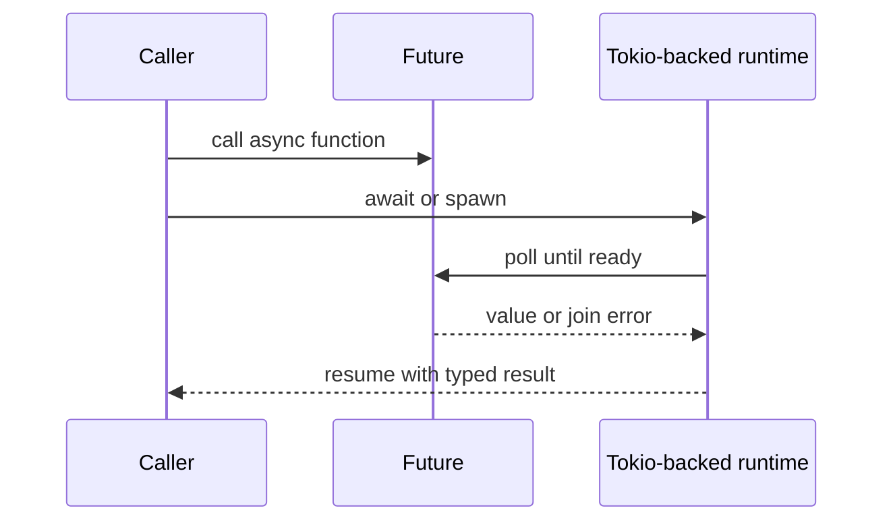

# Async Programming in Incan

Incan supports async/await through the current Tokio-backed runtime path. This guide covers the current `std.async` surface available in Incan.

!!! important "Async is import-activated"
    `async` and `await` are **soft keywords**: they become reserved keywords only after importing `std.async` (for example `import std.async` or `from std.async.time import sleep`).

!!! note "Coming from Python?"
    Incan keeps the familiar `async def` and `await` authoring shape, but it is not an `asyncio` compatibility layer. Task spawning, timeouts, cancellation, and runtime behavior follow Incan's `std.async` contracts and the current Tokio-backed runtime path.

    The key difference is under the hood: the current beta builds through Rust and uses Tokio, giving you familiar Python-shaped syntax with a native async runtime.



<p class="inc-diagram-caption">Calling creates async work; <code>await</code> or task APIs let the runtime drive it to a typed result.</p>

## Quick Start

```incan
from std.async.time import sleep

async def fetch_data() -> str:
    await sleep(1.0)  # Wait 1 second
    return "data"

def main() -> None:
    # When async is used, main automatically gets #[tokio::main]
    println("Starting...")
```

## Core Concepts

### Cancellation Vocabulary

Async APIs in `std.async` document cancellation with four contract terms:

| Term                    | Meaning                                                                                                                                     |
| ----------------------- | ------------------------------------------------------------------------------------------------------------------------------------------- |
| `cancel-safe`           | Cancelling a pending wait does not consume the value, acquire the resource, or otherwise complete the operation.                            |
| `cancel-safe-but-lossy` | Cancelling the wait does not complete the operation, but a value or queue position owned by that wait may be lost.                          |
| `not cancel-safe`       | Cancelling a pending wait can break the operation's coordination contract or leave other participants waiting.                              |
| `durable once spawned`  | Work continues after it is spawned unless it finishes or is explicitly aborted; dropping the handle detaches the work and loses the result. |

### Async Functions

Declare async functions with `async def`:

```incan
from std.async.time import sleep

async def do_work() -> int:
    await sleep(0.5)
    return 42
```

### Await

Use `await` to wait for an async operation:

```incan
import std.async

async def process() -> str:
    data = await fetch_data()
    result = await transform(data)
    return result
```

`await` is only valid inside `async def` bodies and **async** methods. Using `await` in an ordinary `def` or sync method is a type error. Calling an async function or method as a direct value without `await` produces a compiler warning; pass async work to task APIs such as `spawn()` when another async API should consume it.

!!! info "Coming from Python?"
    Incan's `await` follows the same rules as in Python: it is disallowed outside an `async` scope.

### Awaitable

`Awaitable[T]` is the protocol for values that can be awaited to produce `T`.

```incan
import std.async

async def wait_for[T, F with Awaitable[T]](task: F) -> T:
    return await task
```

The compiler recognizes direct async calls, Rust-backed futures, `JoinHandle[T]`, and checked wrapper types. Awaiting a `JoinHandle[T]` produces `Result[T, TaskJoinError]`, not `T`, because the spawned task can fail to join.

Wrapper types can adopt `Awaitable[T]` only when they contain a compatible awaitable field:

```incan
import std.async
from std.async.task import JoinHandle, TaskJoinError

model TaskBox[T] with Awaitable[Result[T, TaskJoinError]]:
    handle: JoinHandle[T]

async def wait_for(box: TaskBox[int]) -> Result[int, TaskJoinError]:
    return await box
```

## Time Primitives

### sleep

Pause execution for a duration:

```incan
from std.async.time import sleep, sleep_ms

async def demo() -> None:
    await sleep(1.5)      # Sleep 1.5 seconds
    await sleep_ms(500)   # Sleep 500 milliseconds
```

### timeout

Run an operation with a time limit:

```incan
from std.async.time import timeout

async def demo() -> None:
    result = await timeout(5.0, slow_operation)
    match result:
        case Ok(value): println(f"Success: {value}")
        case Err(e): println("Operation timed out")
```

`timeout()` and `timeout_ms()` cancel the supplied future when the deadline expires. That is appropriate for ordinary request work where the timed-out operation should stop. If the work must keep running after the deadline path returns, spawn it first and use `timeout_join()` so the timeout result preserves the live `JoinHandle`.

### timeout_join

Wait for spawned work without cancelling it when the deadline expires:

```incan
from std.async.task import spawn
from std.async.time import timeout_join, TimeoutJoinOutcome

handle = spawn(write_audit_event(event))

match await timeout_join(1.0, handle):
    case TimeoutJoinOutcome.Completed(_): println("audit event written")
    case TimeoutJoinOutcome.JoinFailed(err): println(err.message())
    case TimeoutJoinOutcome.TimedOut(live_handle):
        remember(live_handle)
```

Use `timeout_join()` for side-effecting work that must keep running once spawned, such as durable writes, protocol commits, and file flushes. On timeout, the task continues running and `TimeoutJoinOutcome.TimedOut(handle)` carries the live handle so you can await it later, store it in a task registry, or abort it deliberately. If an outer cancellation boundary cancels the `timeout_join()` call itself before it returns, the helper-owned handle is dropped and the task is detached unless you arranged another completion path. For `spawn_blocking()` handles, `abort()` can only prevent queued work from starting; blocking work that has already started must finish on its own.

## Racing Awaitables

Use `std.async.race` when several awaitables are valid ways to produce one result and the first completion should win:

```incan
from std.async.race import arm, race
from std.async.time import sleep

def label(value: int) -> str:
    return f"winner:{value}"

async def fast() -> int:
    return 1

async def slow() -> int:
    await sleep(0.5)
    return 2

async def main() -> None:
    result = await race(arm(slow(), label), arm(fast(), label))
    println(result)
```

`arm(awaitable, on_win)` packages one branch and its callback. `race(*arms)` polls all arms concurrently, returns the winning callback result, and drops losing arms. If multiple arms are ready in the same poll, source order breaks the tie.

## Task Spawning

### spawn

Run a task concurrently:

```incan
from std.async.task import spawn
from std.async.time import sleep

async def background_work() -> int:
    await sleep(2.0)
    return 42

# Spawn returns immediately
handle = spawn(background_work)

# Do other work...
println("Working on other things...")

# Wait for the spawned task
result = await handle
println(f"Background task returned: {result}")
```

Spawned tasks are durable once spawned. Dropping `handle` detaches the task and loses the result; it does not cancel the task. Use `handle.abort()` when an async task should be cancelled.

### spawn_blocking

Run CPU-intensive or blocking code on a dedicated thread:

```incan
from std.async.task import spawn_blocking

def heavy_computation() -> int:
    result = 0
    for i in range(1_000_000):
        result = result + i
    return result

# Won't block the async runtime
result = await spawn_blocking(heavy_computation)
```

`spawn_blocking()` is for bounded blocking work that eventually finishes on its own. Dropping its `JoinHandle` detaches the work and loses the result, and `abort()` cannot stop blocking work after it starts running. `abort()` can only prevent a queued blocking task from starting.

### yield_now

Cooperatively yield to let other tasks run:

```incan
from std.async.task import yield_now

async def cooperative_loop() -> None:
    for i in range(10000):
        # Do some work...
        if i % 100 == 0:
            await yield_now()  # Let other tasks run
```

## Synchronization Primitives

Incan provides low-level synchronization primitives inspired by Rust's tokio runtime. These give you fine-grained control over shared state and task coordination.

!!! note "Coming from Python?"
    Python's `asyncio` has some equivalents, but Incan's primitives work differently.

| Incan       | Python asyncio            | Key Difference                                       |
| ----------- | ------------------------- | ---------------------------------------------------- |
| `Mutex[T]`  | `asyncio.Lock`            | Incan wraps the value; Python protects external data |
| `RwLock[T]` | *(no equivalent)*         | Allows multiple readers OR single writer             |
| `Semaphore` | `asyncio.Semaphore`       | Similar behavior                                     |
| `Barrier`   | `asyncio.Barrier` (3.11+) | Similar behavior                                     |

The key difference: Incan's `Mutex[T]` and `RwLock[T]` **wrap a value** (like Rust), while Python's Lock is just a lock you use alongside your data.

### Mutex

Mutual exclusion — ensures only **one task** can access the wrapped value at a time.

**When to use:** Multiple tasks need to both read AND write shared state.

**API:**

- `Mutex.new(value)` — Create a mutex wrapping a value
- `await mutex.lock()` — Acquire lock, returns a guard
- `guard.get()` — Read the value
- `guard.set(new_value)` — Write a new value
- Guard auto-releases when it goes out of scope

```incan
from std.async.sync import Mutex

shared_counter = Mutex.new(0)

async def increment() -> None:
    guard = await shared_counter.lock()  # Blocks until lock acquired
    current = guard.get()
    guard.set(current + 1)
    # Lock released when guard goes out of scope
```

`mutex.lock()` is cancel-safe-but-lossy: cancellation before the guard is returned does not acquire the lock, but the waiter loses its place in the fairness queue.

!!! note "Python comparison"
    Python uses a lock separate from the data. Incan wraps the data (`Mutex[T]`), so the lock and value are kept together.

```python
# Python - lock is separate from data
lock = asyncio.Lock()
counter = 0

async def increment():
    async with lock:
        counter += 1
```

```incan
from std.async.sync import Mutex

# Incan - lock wraps the data
counter = Mutex.new(0)

async def increment() -> None:
    guard = await counter.lock()
    guard.set(guard.get() + 1)
```

### RwLock

Reader-writer lock — allows **multiple readers** OR a **single writer**, but not both simultaneously. More efficient than Mutex when reads are frequent.

**When to use:** Many tasks read, few tasks write (e.g., configuration, caches).

**API:**

- `RwLock.new(value)` — Create an RwLock wrapping a value
- `await rwlock.read()` — Acquire read lock (shared with other readers)
- `await rwlock.write()` — Acquire write lock (exclusive)
- `guard.get()` — Read the value
- `guard.set(new_value)` — Write (only on write guard)

```incan
from std.async.sync import RwLock

config = RwLock.new(Config(debug=False))

async def read_config() -> bool:
    guard = await config.read()  # Multiple readers allowed simultaneously
    return guard.get().debug

async def update_config(debug: bool) -> None:
    guard = await config.write()  # Waits for all readers, then exclusive
    guard.set(Config(debug=debug))
```

`rwlock.read()` and `rwlock.write()` are cancel-safe-but-lossy: cancellation before a guard is returned does not acquire the lock, but the waiter loses its place in the fairness queue.

!!! note "Coming from Python?"
    Python's `asyncio` doesn't have `RwLock`. This is a Rust/systems programming concept.

    If you need read-heavy access patterns in Python, you typically just use a `Lock` for everything.

### Semaphore

Counting semaphore — limits how many tasks can access a resource concurrently by managing a pool of "permits."

**When to use:** Connection pools, rate limiting, bounding concurrent operations.

**API:**

- `Semaphore.new(n)` — Create with n permits
- `await sem.acquire()` — Wait for and acquire a permit
- Permit auto-releases when it goes out of scope

```incan
from std.async.sync import Semaphore

# Allow max 3 concurrent connections
connection_limit = Semaphore.new(3)

async def make_request() -> Response:
    permit = await connection_limit.acquire()  # Blocks if no permits
    response = await http_get(url)
    # Permit released automatically when permit goes out of scope
    return response
```

`sem.acquire()` is cancel-safe-but-lossy: cancellation before a permit is returned does not acquire a permit, but the waiter loses its place in the fairness queue.

!!! note "Python equivalent"
    `asyncio.Semaphore(n)` works the same way.

### Barrier

Synchronization point — makes N tasks wait until **all of them** reach the barrier before any can proceed.

**When to use:** Phased algorithms, coordinating startup, map-reduce patterns.

**API:**

- `Barrier.new(n)` — Create barrier for n tasks
- `await barrier.wait()` — Wait until all n tasks reach this point

```incan
from std.async.sync import Barrier

barrier = Barrier.new(3)  # Wait for 3 tasks

async def worker(id: int) -> None:
    println(f"Worker {id} starting phase 1")
    # ... do phase 1 work ...
    
    await barrier.wait()  # All 3 must reach here before anyone continues
    
    println(f"Worker {id} starting phase 2")  # All start phase 2 together
```

`barrier.wait()` is cancellation-aware before release: cancelling a pending wait withdraws that participant from the current generation and frees its slot. Remaining participants still need enough active arrivals to complete the generation, so workflows that allow independent participant cancellation should also define how replacement participants arrive or how the whole phase is abandoned. The returned slot is unique within a completed generation, but cancellation can reuse freed slots, so do not treat it as chronological arrival order.

!!! note "Python equivalent"
    `asyncio.Barrier(n)` (added in Python 3.11) works the same way.

### Complete Example

See [examples/advanced/async_sync.incn](https://github.com/encero-systems/incan/blob/main/examples/advanced/async_sync.incn) for a runnable demo of all four primitives.

## Race and Timeout Helpers

### race_timeout

Simplified timeout returning Option:

```incan
from std.async.race import race_timeout

match await race_timeout(2.0, slow_operation):
    case Some(result): println(f"Got: {result}")
    case None: println("Timed out, using default")
```

`race_timeout()` has the same cancellation contract as `timeout()`: if the deadline wins, the supplied future is cancelled. Use it only when the timed-out future may be safely abandoned. For spawned work that must continue, use `timeout_join()` instead.

Future `race` syntax is planned as first-completion-wins composition. Losing race arms are cancelled, so loser arms must not contain side effects that are required for correctness after their final suspension point. Put required cleanup in cancellation-safe resources, or spawn durable work before the race and use a handle-preserving wait such as `timeout_join()` when you still need the result.

## Runtime Integration

### Automatic Tokio Main

When your program uses async features, the `main()` function is automatically wrapped with `#[tokio::main]`:

Tokio is Rust's async runtime: see the [Tokio project](https://tokio.rs/) for a high-level overview.

```incan
import std.async

def main() -> None:
    # This becomes async main() under the hood
    # when async primitives are used
    result = await fetch_data()
    println(f"Result: {result}")
```

### Generated Dependencies

Generated projects enable Tokio through the `incan_stdlib` async feature rather than adding a direct Tokio dependency for ordinary async stdlib use:

```toml
[dependencies]
incan_stdlib = { path = "...", features = ["async"] }
```

## Best Practices

### 1. Don't Block the Runtime

Avoid blocking operations in async code:

```incan
from std.async.time import sleep

# BAD: Blocks the async runtime
async def bad() -> None:
    std_thread_sleep(1.0)  # Don't do this!

# GOOD: Use async sleep
async def good() -> None:
    await sleep(1.0)
```

### 2. Use spawn_blocking for CPU Work

```incan
from std.async.task import spawn_blocking

# BAD: CPU work on async runtime
async def bad() -> int:
    return heavy_computation()

# GOOD: Offload to blocking pool
async def good() -> int:
    return await spawn_blocking(heavy_computation)
```

### 3. Handle Cancellation Explicitly

Dropping a task handle detaches the task and loses its result. It does not cancel the task:

```incan
from std.async.task import spawn
from std.async.time import sleep

async def cancellable_work() -> str:
    await sleep(10.0)
    return "done"

handle = spawn(cancellable_work)
# This detaches the task and loses the result; the task keeps running.
_ = handle
```

Use `handle.abort()` when an async task should be cancelled. For blocking work created with `spawn_blocking()`, `abort()` only has a chance to prevent execution before the blocking task starts.

## Error Handling

### Timeout Errors

```incan
from std.async.time import timeout

result = await timeout(1.0, slow_task)
match result:
    case Ok(value): process(value)
    case Err(e): println(f"Timed out: {e}")
```

## See Also

- [Error handling](../explanation/error_handling.md) - Concepts: `Result`, `Option`, `?`, `match`
- [Error handling recipes](../how-to/error_handling_recipes.md) - Patterns and best practices
- [Error trait](../reference/stdlib_traits/error.md) - Stdlib trait reference
- [Examples: Async Tasks](https://github.com/encero-systems/incan/blob/main/examples/advanced/async_tasks.incn)
- [Examples: Synchronization](https://github.com/encero-systems/incan/blob/main/examples/advanced/async_sync.incn)
