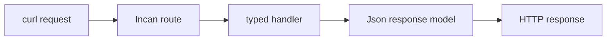

# Build your first API (tutorial)

This tutorial walks you through running the built-in web framework and serving a JSON endpoint.

<ol class="inc-step-rail" style="--inc-step-count: 3" aria-label="API tutorial steps">
  <li><strong>Build</strong>Compile the example</li>
  <li><strong>Request</strong>Hit the endpoints</li>
  <li><strong>Understand</strong>Trace typed responses</li>
</ol>

Prerequisite: [Install, build, and run](../../tooling/how-to/install_and_run.md).

!!! note "If something fails"
    If you hit errors while building/running, start with [Troubleshooting](../../tooling/how-to/troubleshooting.md). If it still looks like a bug, please [file an issue on GitHub](https://github.com/encero-systems/incan/issues).

## Step 1: Run the hello web example

The repo includes a runnable example:

- Source: `examples/web/hello_web.incn`
- GitHub: `https://github.com/encero-systems/incan/blob/main/examples/web/hello_web.incn`

Build it:

```bash
incan build examples/web/hello_web.incn
```

--8<-- "_snippets/callouts/no_install_fallback.md"

Note: the first build may download Rust crates via Cargo (can take minutes) and requires internet access.

Run the compiled binary:

```bash
./target/incan/.cargo-target/release/hello_web
```

## Step 2: Hit the endpoints



<p class="inc-diagram-caption">The route selects a typed handler; the response model is serialized at the HTTP boundary.</p>

In another terminal:

```bash
curl http://localhost:8080/
curl http://localhost:8080/api/greet/World
curl http://localhost:8080/api/user/42
curl http://localhost:8080/health
```

<section class="inc-learning-panel inc-learning-panel--result" data-label="Expected" markdown="1">

The root and greeting routes return successful text or JSON responses, `/api/user/42` returns the typed user payload, and `/health` confirms the server is ready.

</section>

## Step 3: Understand what you’re seeing

The example demonstrates:

- `@route("/path")` for routes (imported from `std.web.routing`)
- `Json[T]` for JSON responses
- `@derive(json)` for response models
- `async def` handlers (async/await)

Learn more:

- Web framework guide: [Web Framework](web_framework.md)
- Models: [Models & Classes](../explanation/models_and_classes/index.md)
- Errors: [Error Handling](../explanation/error_handling.md)
- Modules: [Imports and modules (how-to)](../how-to/imports_and_modules.md)

<section class="inc-learning-panel inc-learning-panel--complete inc-incus-slot" data-label="Complete" data-incus-category="success" markdown="1">

You have built a native server, exercised four routes, and followed one request from route selection to a typed response model.

</section>
