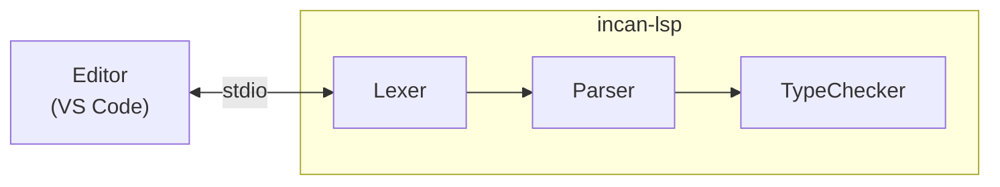

# LSP architecture

This page explains how the Incan Language Server works internally.

## High-level design

The LSP is built with [tower-lsp](https://github.com/ebkalderon/tower-lsp) and reuses Incan's compiler frontend.

On each file change, the LSP runs the compiler pipeline and reports:

- lexer errors (tokenization failures)
- parser errors (syntax errors)
- type errors (type mismatches, unknown symbols, etc.)
- checked public API metadata hover previews when typechecking succeeds
- checked `std.registry` membership hover and decorator navigation when typechecking succeeds
- checked C binding and raw-call hover/navigation facts when typechecking succeeds
- Contract-backed model emit through `workspace/executeCommand` command `incan.metadata.model.emit`

The LSP keeps checked API metadata, registry-description facts, and checked C binding descriptors in memory for hover and definition navigation. It projects the same successful typecheck artifact rather than reparsing `@describe` syntax, reconstructing a C declaration from generated Rust, or querying linker state, so editor details cannot silently diverge from compiler validation. Full checked API metadata package retrieval remains a CLI surface through `incan tools metadata api`. Contract model emit can inspect project bundle metadata, bundle JSON files, or `.incnlib` artifacts through the explicit `incan.metadata.model.emit` command.

## Semantic tokens

The protocol has the server classify a whole document: the server publishes a legend of token types and modifiers, and answers `textDocument/semanticTokens/full` with one entry per token that indexes into it. There is no way to classify part of a file and leave the rest to the editor's own grammar, so the server classifies every token.

The legend uses only standard LSP token types and modifiers. An editor renders a custom type it does not know with no color at all, which would make the regions a library vocabulary owns less visible rather than more. Because each token refers to its type by index, the legend's order is part of the wire contract: appending an entry is safe, while reordering would recolor every document.

An embedded fragment, where a library vocabulary claims another language's syntax inside Incan source, is highlighted as its own submode, so a markup tag or a style selector never looks like an Incan local. The expression holes inside the fragment are ordinary Incan and are highlighted as such. A document that does not parse is still highlighted from its token stream, losing only type positions and fragment ownership, so color does not disappear while you type.

Hover follows the same rule as the rest of the server: checked metadata appears only after a successful typecheck, and a document with parse or type errors falls back to syntax-level hover details while its diagnostics stay the source of truth.
